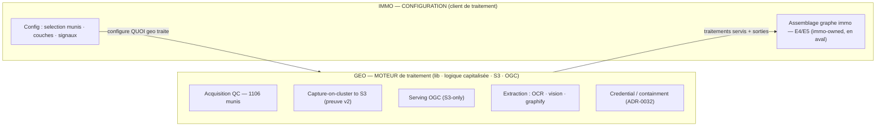
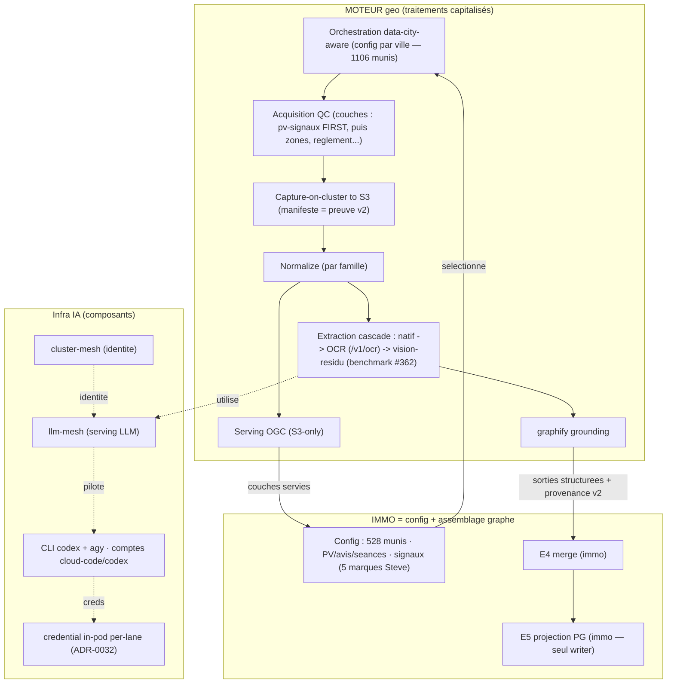

# Dossier PIPELINE end-to-end — **GEO-FIRST** : moteur geo, config immo (un schéma par composant)

> **Reprise (directive owner-directe, 2026-09-06)** de `PIPELINE_FULLAUTO_GEO_SECTION.md` (#357) → **dossier
> geo-first COMPLET**, « repris avec des schémas pour bien prendre en compte tous les composants ». **Auteur** :
> geo-archi (wp6). **Source-of-truth** : ce markdown + mermaid committé (autorité durable, versionnée,
> reproductible — house-convention). **Présentation** : geo-cond livre à l'owner (clôture present-decision §7) ;
> le rendu Artefact h2a-focus (schéma-riche, décisions cliquables) est **mécanique** depuis cette source.
>
> **Thèse owner-directe (gravée)** : **GEO = MOTEUR de traitement ; IMMO = CONFIGURATION** (« les traitements immo
> devraient être vus comme des configs de traitements geo »). **Nuance de fidélité** (present-decision : représentation
> fidèle > thèse lisse) : « immo=config » tient pour la **couche traitement** ; **immo assemble AUSSI son graphe**
> (E4/E5, immo-owned) **en aval** du moteur — on ne l'aplatit pas en « stage moteur geo ».
>
> **Directives owner intégrées** : (a) **un schéma par composant** (liste autoritative §2) ; (b) **ordre des couches
> = pv-signaux (scrap récurrents) EN PREMIER**, puis zones, règlement, etc. (§4) ; (c) immo = **client de traitement
> configuré dans geo** ; (d) composants explicites : cluster-mesh, llm-mesh, CLI codex+agy+comptes(cloud-code/codex),
> graphify, OCR, orchestration **data-city-aware** + config par ville (1106 munis).

---

## §0 — Cadre & thèse : geo = MOTEUR, immo = CONFIG

**[FAIT — principe fondateur]** `@sentropic/geo` = « toute logique se capitalise dans la **lib**, toute donnée captée
se dépose sur le **stockage objet** ». Le moteur de traitement **EST** la lib geo ; un client (immo) n'ajoute pas de
logique — il **configure** quels traitements du moteur tournent, sur quelles villes, quelles couches, quels signaux.

**[JUGEMENT — thèse owner]** ⟹ **immo/radar-immobilier = une CONFIGURATION** du moteur geo (sélection munis/couches/
signaux), **PAS** un pipeline parallèle. Ce qui est spécifique-immo se réduit à **(a)** une config de sélection et
**(b)** l'**assemblage de son propre graphe** (E4/E5) en aval — jamais à de la logique de traitement dupliquée.

**Frontière honnête** : la flèche `GEO → C2` traverse une **frontière de propriété** — E4 (merge) et E5 (projection
PG, seul writer) sont **immo-owned** (`radar-immobilier api/src/services/graph/` : `canonical-graph-writer.ts`,
`graph-store.ts::upsertGraphAtomic`). Le moteur geo **alimente** ; immo **assemble**. (Contrat d'alimentation = seam
i-arch + geo-cond.)

---

## §1 — Carte end-to-end (schéma-maître)

Tous les composants et le flux, du scrap récurrent au graphe immo. Le **moteur geo** (traitements) alimente la
**config immo** (sélection + assemblage graphe) ; l'**infra IA** (mesh/CLI/credential) porte la jambe LLM.

**Lecture** : (1) la **config immo** sélectionne villes/couches/signaux → (2) l'**orchestration data-city-aware**
déclenche l'acquisition par ville → (3) **capture→S3→normalize→serving** (colonne repro, §5) → (4) **extraction**
(cascade LLM-minimal, jambe IA §2) → (5) **graphify** produit des sorties structurées → (6) immo **assemble son
graphe** (E4/E5). Le DAG est **souverain** (`@sentropic/s3-dag`, D-moteur-1) : le LLM n'ordonnance jamais.

---

## §2 — Composants d'infrastructure IA (un schéma chacun) — *[à remplir]*

> Liste **autoritative owner**. Chaque composant = un schéma + FAIT/JUGEMENT + état (existe/à-créer) + réf.

- **§2.1 cluster-mesh** — fédération d'**identité** (route 0 LLM ; `git grep cluster-mesh` geo = 0). Schéma : identité workload → policy.
- **§2.2 llm-mesh** — **serving/routing LLM** (catalogue : gpt-5.6-luna/terra, sonnet-5, etc.). Schéma : caller → mesh → pool/CLI.
- **§2.3 CLI codex + agy + comptes CLI (cloud-code, codex)** — enrôlement des comptes ; jambes codex (`~/.codex/auth.json`) et gemini (`cloud-code-transport.ts`). Schéma : enroll → compte-par-lane → appel in-pod-direct.
- **§2.4 credential / containment (ADR-0032, accepted)** — **D1=A in-pod-direct** ; **compte-par-lane = le cap** (externe) ; codex CLI-direct / gemini in-pod-direct (requiert `8aee7f615`) ; 3e terme (fallback) sans objet dès le per-lane-binding ; parité/cap-gateway MOOT. Schéma : containment compte-par-lane.
- **§2.5 graphify + traitements geo configurés** — couche knowledge-graph (grounding) ; PV pilot ; typed-linking (proposal externe). Schéma : extraction → graphify → entités/relations.
- **§2.6 OCR / vision (extraction)** — cascade natif → OCR (`mistral-ocr`, `/v1/ocr` sanctionné) → **vision-résidu** (ban ADR-0024 ; remplaçant benchmark `{luna, sonnet-5, terra}`, protocole #362). Schéma : cascade + gates coût/gold.

## §3 — Orchestration DATA-CITY-AWARE + config par ville (1106 munis) — *[à remplir]*

> Le moteur traite **par ville** ; la config par ville pilote quels traitements/couches tournent. Refresh Controller /
> DAG-invalidation-par-hash / staging versionné (`s3-dag` D-moteur-1). Schéma : city-config → DAG par ville → refresh.

## §4 — Les COUCHES (ordre owner : **pv-signaux FIRST**) — *[à remplir]*

> **Ordre owner-spécifié** : (1) **pv-signaux (scrap récurrents) = LEAD** → (2) zones → (3) règlement → (4)
> usage-dominant / effet-densifiant / cadastre-rôle / immo-lots → (5) env (CPTAQ/BDZI/GRHQ) → (6) satellite/3D VIEW.
> Chaque couche = un schéma (source, capture, extraction, serving, provenance).

- **§4.1 pv-signaux (scrap récurrents) — COUCHE-LEAD** : scrap worker-live → détection → OCR/vision → signaux (`qc-zoning-events`, avis-motion-lifecycle, 5 marques Steve). Schéma.
- **§4.2 zones (règlementaires réelles, #632)** · **§4.3 règlement** · **§4.4 usage/densif/cadastre-rôle/lots** · **§4.5 env (CPTAQ servi / BDZI+GRHQ Phase-2)** · **§4.6 satellite 2D (0.6.1) / 3D (track séparé)**.

## §5 — Colonne repro / preuve-v2 (capture-on-cluster → S3 → serving) — *[à remplir]*

> Le principe fondateur en schéma : **JAMAIS de capture locale** ; scrape sur **cluster** → écrit **S3** (octets +
> manifeste `url/retrieved_at/sha256/statut` = **preuve v2**) → normalize → serving OGC S3-only. « Vert par omission
> = rouge ». Schéma : capture-cluster → S3(preuve) → normalize → serving.

## §6 — IMMO = client configuré (config-view — absorbe #634) — *[à remplir]*

> La vue-config immo dans le moteur geo. **Sélection** : ~528 munis · PV/avis-motion/séances · signaux · les couches
> geo superposées (zones réelles, satellite, env). **Assemblage graphe** : E4 merge → E5 projection PG (immo-owned,
> en aval — frontière honnête §0). Source : #634 `PIPELINE_FULLAUTO_CLUSTER_MESH.md`. Schéma : config → moteur →
> assemblage-graphe-immo.

## §7 — Décision demandée / attendus / options / disclosure *(present-decision — geo-cond présente)* — *[à remplir]*

> Ce que l'owner ratifie : le **cadre geo=moteur/immo=config** + l'archi end-to-end schématisée. Stakes · options ·
> attendus (checklist) · strongest-case-against · pré-mortem · disclosure d'intérêt-agent.

---

## Notes de reprise (traçabilité)

- **Absorbé de #357** (`PIPELINE_FULLAUTO_GEO_SECTION.md`) : les 2 gates AI (GATE#1 vision ADR-0024 → **résolu** §2.6/#362 ; GATE#2 hosting D-moteur-2 → **résolu** ADR-0032 §2.4), SD-1 satellite/3D → §4.6, SD-2 extraction → §2.5/§2.6 + §4, orchestration s3-dag → §3, contrat d'alimentation graphe → §6 (frontière E4/E5).
- **Réfs** : ADR-0032 (credential/containment) · ADR-0024 (ban vision) · #362 (protocole benchmark vision/OCR) · #634 (pipeline immo canonique = vue-config) · ADR-0027/0030/0031 (preprod/serving/basemap) · principe fondateur (CLAUDE.md).
