# Dossier PIPELINE end-to-end — **GEO-FIRST** : moteur geo, config immo (un schéma par composant)

> **Reprise (directive owner-directe, 2026-09-06)** de `PIPELINE_FULLAUTO_GEO_SECTION.md` (#357) → **dossier
> geo-first COMPLET**, « repris avec des schémas pour bien prendre en compte tous les composants ». **Auteur** :
> geo-archi (wp6). **Source-of-truth** : ce markdown + mermaid committé (autorité durable, versionnée,
> reproductible — house-convention). **Présentation** : geo-cond livre à l'owner (clôture present-decision §7) ;
> le rendu Artefact h2a-focus (schéma-riche, décisions cliquables) est **mécanique** depuis cette source.
>
> **Thèse owner-directe (gravée)** : **GEO = MOTEUR de traitement ; IMMO = CONFIGURATION** (« les traitements immo
> devraient être vus comme des configs de traitements geo »). **Nuance de fidélité** (present-decision : représentation
> fidèle > thèse lisse) : « immo=config » tient pour la **couche traitement** ; **immo assemble AUSSI son graphe**
> (E4/E5, immo-owned) **en aval** du moteur — on ne l'aplatit pas en « stage moteur geo ».
>
> **Directives owner intégrées** : (a) **un schéma par composant** (liste autoritative §2) ; (b) **ordre des couches
> = pv-signaux (scrap récurrents) EN PREMIER**, puis zones, règlement, etc. (§4) ; (c) immo = **client de traitement
> configuré dans geo** ; (d) composants explicites : cluster-mesh, llm-mesh, CLI codex+agy+comptes(cloud-code/codex),
> graphify, OCR, orchestration **data-city-aware** + config par ville (1106 munis).

---

## §0 — Cadre & thèse : geo = MOTEUR, immo = CONFIG

**[FAIT — principe fondateur]** `@sentropic/geo` = « toute logique se capitalise dans la **lib**, toute donnée captée
se dépose sur le **stockage objet** ». Le moteur de traitement **EST** la lib geo ; un client (immo) n'ajoute pas de
logique — il **configure** quels traitements du moteur tournent, sur quelles villes, quelles couches, quels signaux.

**[JUGEMENT — thèse owner]** ⟹ **immo/radar-immobilier = une CONFIGURATION** du moteur geo (sélection munis/couches/
signaux), **PAS** un pipeline parallèle. Ce qui est spécifique-immo se réduit à **(a)** une config de sélection et
**(b)** l'**assemblage de son propre graphe** (E4/E5) en aval — jamais à de la logique de traitement dupliquée.

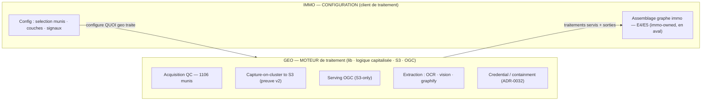

**Frontière honnête** : la flèche `GEO → C2` traverse une **frontière de propriété** — E4 (merge) et E5 (projection
PG, seul writer) sont **immo-owned** (`radar-immobilier api/src/services/graph/` : `canonical-graph-writer.ts`,
`graph-store.ts::upsertGraphAtomic`). Le moteur geo **alimente** ; immo **assemble**. (Contrat d'alimentation = seam
i-arch + geo-cond.)

---

## §1 — Carte end-to-end (schéma-maître)

Tous les composants et le flux, du scrap récurrent au graphe immo. Le **moteur geo** (traitements) alimente la
**config immo** (sélection + assemblage graphe) ; l'**infra IA** (mesh/CLI/credential) porte la jambe LLM.

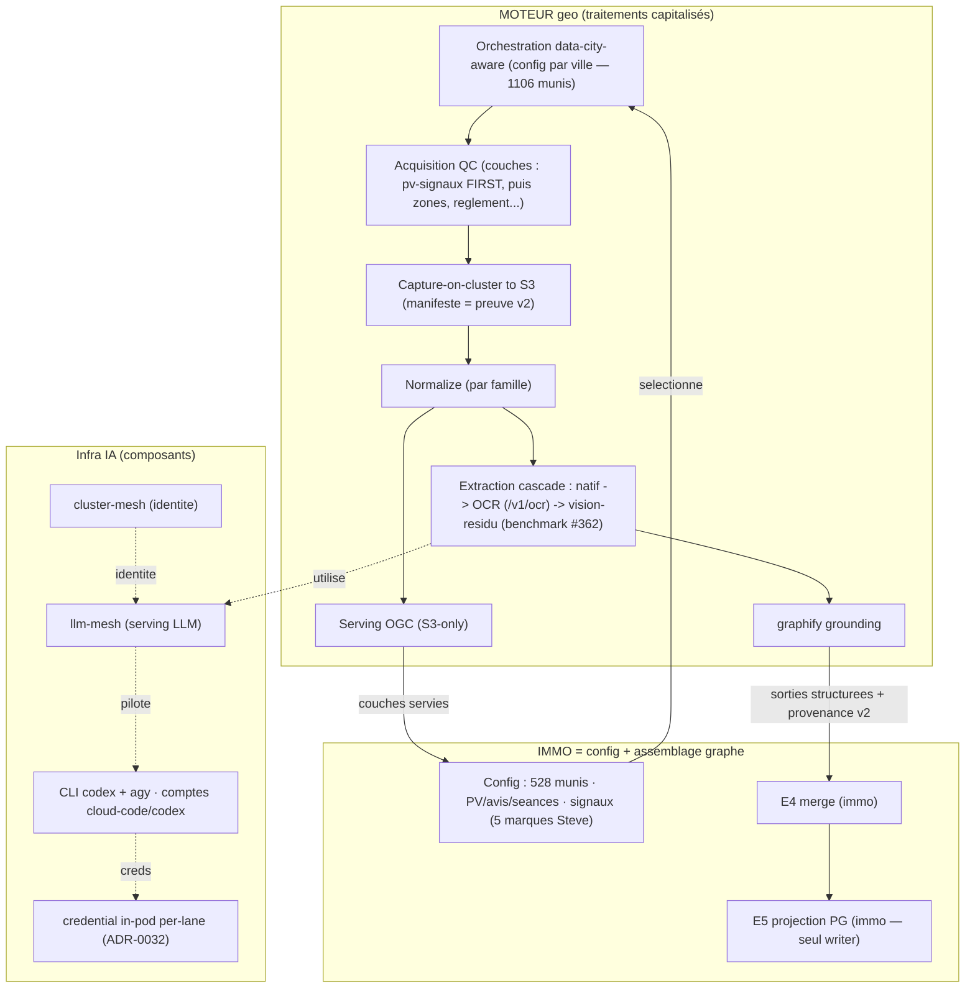

**Lecture** : (1) la **config immo** sélectionne villes/couches/signaux → (2) l'**orchestration data-city-aware**
déclenche l'acquisition par ville → (3) **capture→S3→normalize→serving** (colonne repro, §5) → (4) **extraction**
(cascade LLM-minimal, jambe IA §2) → (5) **graphify** produit des sorties structurées → (6) immo **assemble son
graphe** (E4/E5). Le DAG est **souverain** (`@sentropic/s3-dag`, D-moteur-1) : le LLM n'ordonnance jamais.

---

## §2 — Composants d'infrastructure IA (un schéma chacun)

> Liste **autoritative owner**. Chaque composant : FAIT/JUGEMENT + schéma + **état** (existe / à-créer / résolu).

### §2.1 cluster-mesh — fédération d'**identité** (route 0 LLM)
**[FAIT — mesuré]** `@sentropic/cluster-mesh` = **fédération d'identité de workload + policy** ; il **ne route AUCUN
LLM** (`git grep cluster-mesh` en geo = 0 ; seule occurrence = doc-comment `s3-dag/identity.ts:31`). **⚠ Anti-confusion**
(gravé) : « cluster-mesh **LLM-hosting** » du mandat **ne réutilise pas** ce package — l'identité et le serving-LLM sont
**deux composants distincts** (le serving = §2.2).
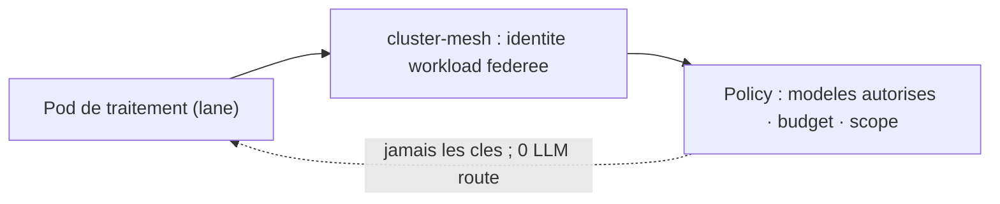
**État** : identité **existe** ; **ne porte pas** le serving LLM.

### §2.2 llm-mesh — serving / routing LLM
**[FAIT]** `@sentropic/llm-mesh` = **lib** de routing/catalogue LLM (catalogue : `gpt-5.6-luna`/`terra`, `claude-sonnet-5`,
`gpt-5.5`, `gpt-5.4-nano`…). **[FAIT — mesuré]** c'est une **bibliothèque, pas un processus déployé** : l'API ne **monte
pas** le routeur ; **aucun manifeste k8s** ne le déploie ; le seul gateway **exécuté** = `h2a-runtime` **host-side**.
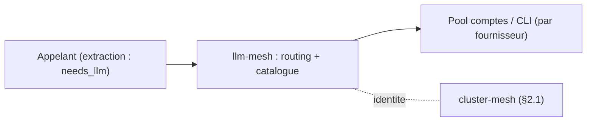
**État** : lib **existe** ; **serving déployé = à bâtir** (sous A : in-pod-direct, pas de gateway — voir §2.4).

### §2.3 CLI codex + agy + comptes CLI (cloud-code, codex)
**[FAIT]** Enrôlement des comptes fournisseur = **`h2a account enroll`** (logique lib `@sentropic/llm-mesh`
`enrollment/*`). **Jambe codex** = CLI codex (`~/.codex/auth.json`, 0600). **Jambe gemini** = **pas de CLI** → HTTP
in-pod via `cloud-code-transport.ts` (compte provider `cloud-code`). Comptes = **cloud-code** + **codex**.
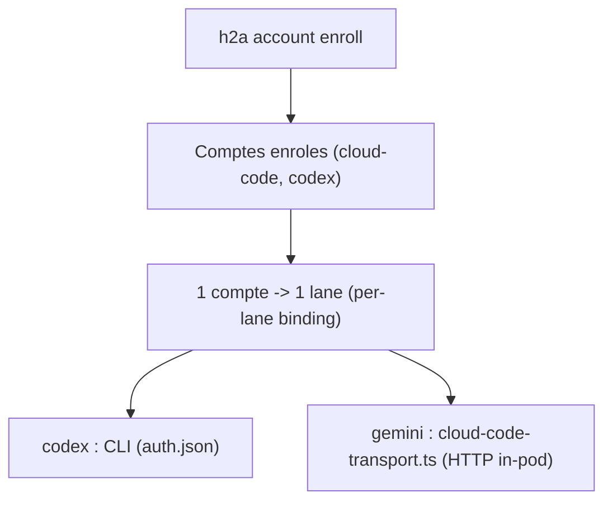
**État** : enroll **host-side satisfait** ; **per-lane-binding = à câbler** (§2.4) ; in-cluster **gaté** (capacité, §7 GATE#2).

### §2.4 credential / containment — **ADR-0032 `accepted` (résolu, D1=A)** — composant gravé
**[FAIT — owner-ratifié, ADR-0032 accepted]** **D1=A : credential IN-POD-DIRECT** (le pod appelle le fournisseur
lui-même ; **pas de gateway** — le démon host-side `:3002` = forme B, écartée). **Containment = le COMPTE ENRÔLÉ PAR
LANE (externe) = le cap** ; **kill-switch = révocation-compte** (externe, par lane) ; compteur in-pod = courtoisie.
codex = CLI-direct (**429-fournisseur** + compte-par-lane) ; gemini = in-pod-direct (**requiert `8aee7f615`** = cause
directe du mode €480 « enrôlement passe / appels échouent »). **3e terme (fallback) SANS OBJET** dès le per-lane-binding ;
**parité / cap-gateway MOOT**.
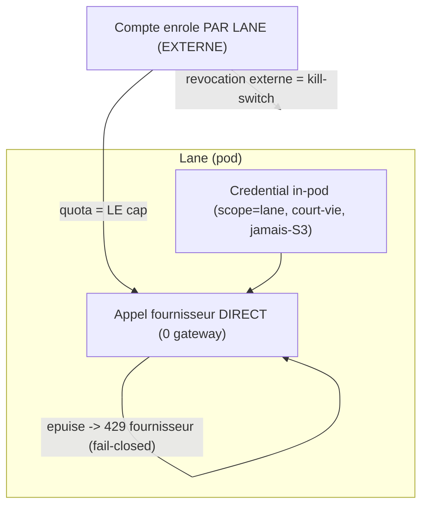
**État** : **RÉSOLU (`accepted`)** — **composant**, plus une décision ouverte. *(Reste build : le per-lane-binding
+ les no-gateway-properties de gemini — non bloquant, build-lane + mesh.)*

### §2.5 graphify + traitements geo configurés
**[FAIT]** `graphify` = couche **knowledge-graph** (grounding des sorties d'extraction en entités/relations). Pilot PV
(`pv-graphify-run.ts`). **[JUGEMENT]** typed-linking `zone_code` = **proposal externe** (non-ratifié au maintainer graphify).
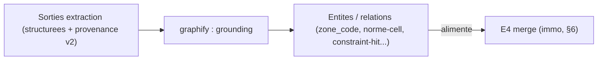
**État** : PV pilot **existe** ; généralisation zonage/règlements = **à créer** (typed-linking gaté externe).

### §2.6 OCR / vision — extraction cascade (**LLM-minimal**)
**[FAIT]** Cascade **natif → `pdftotext` → OCR (`mistral-ocr`, `/v1/ocr` sanctionné) → modèle-fort sur RÉSIDU mesuré
seulement**. **[FAIT]** Vision-chat Mistral **BANNI** (ADR-0024, facture €480) ; garde `vision-engine-policy.ts` live+CI.
Remplaçant vision = **benchmark `{luna, sonnet-5, terra}`** (protocole **#362** : coût/page co-égal, gold-corpus bloquant,
`unknown`-on-failure) — **décision §7 GATE#1**.
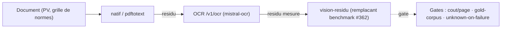
**État** : natif/OCR **opérationnels** ; **vision inopérante (ban) jusqu'au remplaçant validé** (§7 GATE#1).

## §3 — Orchestration DATA-CITY-AWARE + config par ville (1106 munis)

**[FAIT]** Le moteur traite **par ville** : l'univers moteur = **1106 munis** ; un client (immo) en **configure un
sous-ensemble** (~528). **[FAIT]** L'orchestrateur = **`@sentropic/s3-dag`** (D-moteur-1 ratifié) — **DAG souverain** :
un nœud déterministe émet `needs_llm`, le DAG autorise ; **le LLM n'ordonnance jamais**. La config **par ville** pilote
quels traitements/couches tournent ; le refresh est **piloté par invalidation-de-hash** (une source changée
ré-invalide son sous-DAG), avec **staging versionné**.
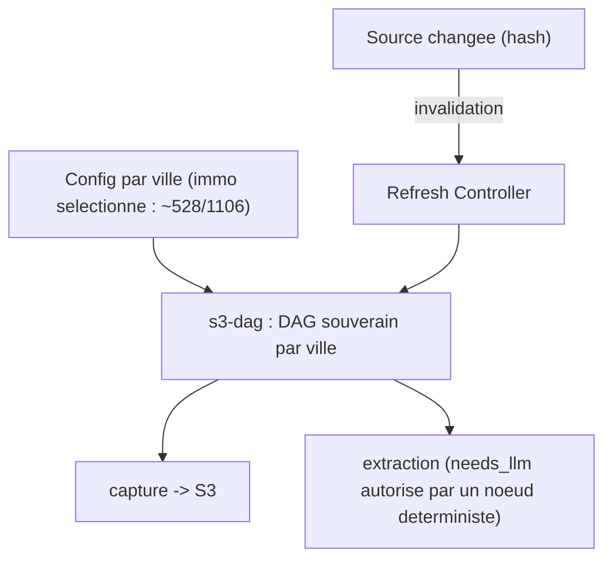
**État** : `s3-dag` **lib testée** (dag/executor-k8s/quota/reconcile) ; **gate 4-preuves canary PV pending** (pas
promu prod) ; Refresh Controller par-lane = **à généraliser**.

---

## §4 — Les COUCHES (ordre owner : **pv-signaux FIRST**)

> **Ordre owner-spécifié** : **(1) pv-signaux (scrap récurrents) = LEAD** → (2) zones → (3) règlement → (4)
> usage-dominant / effet-densifiant / cadastre-rôle / immo-lots → (5) env (CPTAQ/BDZI/GRHQ) → (6) satellite/3D.
> pv-signaux mène **parce que c'est la couche refresh-lourde, la plus dynamique** (cadence de scrap récurrent).

### §4.1 pv-signaux (scrap récurrents) — **COUCHE-LEAD** — la cadence récurrente au premier plan
**[FAIT — pourquoi pv mène]** C'est la seule couche à **cadence récurrente** : les PV/avis-de-motion/séances tombent en
continu → un **cycle de scrap récurrent** détecte les changements et **ré-invalide** le sous-DAG. Les autres couches
(zones, règlement…) sont bien plus statiques. Le schéma **foregrounde le cycle** :
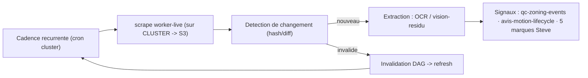
**État** : scrap + signaux **opérationnels** (PV indexés) ; couverture partielle → ré-acquisition continue.

### §4.2–§4.6 — couches suivantes (plus statiques)
- **§4.2 zones (règlementaires réelles)** — vrai code (#632) ; provenance `zone_source_url`/`_level` ; re-stamp en même passe.
- **§4.3 règlement** · **§4.4 usage-dominant / effet-densifiant / cadastre-rôle / immo-lots** — extraction + join lot↔zone.
- **§4.5 env-constraints** — CPTAQ (servi) · **BDZI** (`qc-bdzi-flood-zones`, province-scope) · **GRHQ** (BULK, block-index) — Phase-2.
- **§4.6 satellite/3D VIEW** — 2D client-mint (ADR-0030/0031, 0.6.1, GO#2 owner-gated) ; 3D = track PHOTOREAL séparé (non-ratifiable). **Couche VUE** (feed graphe mince).

**Patron commun §4.2–§4.6** (couches plus statiques — même chaîne que §4.1 **sans** la cadence récurrente) :
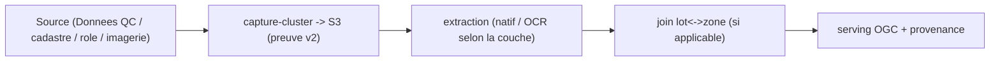
*(Spécifiques par couche dans les puces ci-dessus. Expansion en 1 schéma/couche individualisé possible si l'owner veut chaque couche à part — dis-le.)*

---

## §5 — Colonne repro / preuve-v2 (capture-on-cluster → S3 → serving)

**[FAIT — principe fondateur]** **JAMAIS de capture locale.** Le scraping tourne sur le **cluster** et écrit
**directement S3** : octets bruts **+** manifeste de fetch (`url`, `retrieved_at`, `sha256`, statut HTTP) **= la preuve
v2** exigée par `putServedZoneGeojson`. Les agents locaux **analysent en lecture seule**, ne captent jamais. « **Vert par
omission = rouge** » : un test qui passe parce qu'il ne regarde pas ne prouve rien.
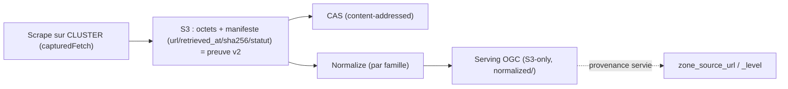
**État** : `capturedFetch`→CAS+preuve-v2 **existe** ; la capture-sur-cluster est **la** colonne de reproductibilité de
tout le dossier (sans elle, KPI preuve-v2 = 0/1106).

---

## §6 — IMMO = client configuré (config-view — absorbe #634)

**[FAIT]** immo/radar = **une configuration** du moteur geo : **(a) sélection** (~528 munis · PV/avis-motion/séances ·
signaux `qc-zoning-events`/avis-motion-lifecycle/**5 marques Steve**) + **(b) couches geo superposées** (zones réelles
#632, satellite 0.6.1, env CPTAQ/BDZI/GRHQ). **[FAIT — frontière fidèle]** immo **assemble AUSSI son graphe** : **E4
merge → E5 projection PG** (seul writer) = **immo-owned** (`radar-immobilier api/src/services/graph/`
canonical-graph-writer + `upsertGraphAtomic`), **en aval** du moteur — **PAS** un stage moteur geo.
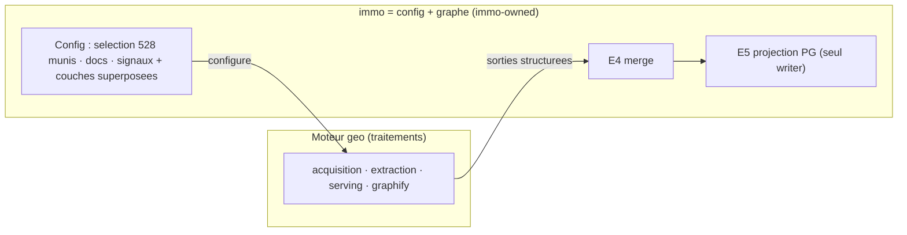
**Source** : #634 `PIPELINE_FULLAUTO_CLUSTER_MESH.md` (pipeline immo canonique) = la **vue-config** absorbée ici.
**État** : E4/E5 **existent** (code immo) ; le **contrat d'alimentation** moteur→E4 = seam i-arch + geo-cond (à cadrer).

---

## §7 — Décision demandée / attendus / options / disclosure *(present-decision — geo-cond présente)*

### Décisions demandées
- **[D-cadre] Ratifier le CADRE** : **geo = MOTEUR de traitement, immo = CONFIGURATION** (client configuré), avec la
  **frontière fidèle** E4/E5 (assemblage-graphe immo, immo-owned, en aval — non aplati). C'est la décision structurante
  du dossier.
- **[GATE #1 — vision-remplaçant (ADR-0024)]** — décision owner-précoce, chemin critique IA. La route vision est
  **inopérante par construction** (ban €480). **Décision** : ratifier le **candidat + méthode** (benchmark
  `{luna, sonnet-5, terra}` sur grilles-gold, 0-Mistral, coût/page co-égal, `unknown`-on-failure — protocole **#362**) ;
  **run gaté** post-restauration Codex/`:3002`. Design+critères **maintenant**, run **après**.
- **[GATE #2 — cluster-mesh-hosting (D-moteur-2)]** — **CONFIRMER la direction owner** (LLM-serving in-cluster) +
  **trade-off exposé**, **PAS re-litiger**. **⚠ Term-lift gravé** : le `@sentropic/cluster-mesh` existant = **identité,
  route 0 LLM** (§2.1) → « cluster-mesh LLM-hosting » = un **serving à bâtir** (§2.2), pas ce package. La **jambe
  credential/identité est DÉJÀ résolue** (ADR-0032, D1=A in-pod-direct, §2.4) ; ce qui reste au GATE#2 = la **FORME de
  serving in-cluster + le levier CAPACITÉ** (98-99% CPU, décision board) — à confirmer.

### Attendus (checklist) · options · pré-mortem · disclosure
- **Attendus** : cadre moteur/config ratifié · GATE#1 (no-Mistral-vision, id résolu, qualité gold, budget/quota) · GATE#2
  (cohérence in-cluster + capacité) · frontière E4/E5 fidèle · principe repro (capture-cluster→S3→preuve-v2) tenu.
- **Options** (D-cadre) : **(a)** ratifier moteur/config tel quel · **(b)** ratifier avec ajustements de frontière
  (ex. E4/E5 futur en stage-moteur-configuré si l'owner le veut — *aujourd'hui le code est immo, je ne le pré-suppose pas*).
- **Strongest-case-CONTRE le cadre** : si des traitements « immo » portent une logique **non capitalisable** dans le
  moteur geo (spécifique-produit irréductible), « immo=config » sur-simplifie → il faut nommer ces exceptions. *(À
  challenger avec i-cond : E4/E5 en est déjà une — assumée.)*
- **Pré-mortem** : « 6 mois plus tard, le cadre a échoué parce qu'on a forcé du produit-immo dans le moteur geo, créant
  un couplage » → **mitigation** : la frontière fidèle E4/E5 (immo-owned) est la soupape ; le cadre régit la **couche
  traitement**, pas l'assemblage-produit.
- **Disclosure d'intérêt-agent** : le cadre geo-first **valorise ma lane (geo/wp6)** → je le signale ; je **tiens la
  frontière fidèle E4/E5** (contre ma propre thèse) précisément pour ne pas sur-vendre le geo-first. Intérêt **owner** =
  logique capitalisée (moins de duplication) + représentation fidèle.

## §4 — Les COUCHES (ordre owner : **pv-signaux FIRST**) — *[à remplir]*

> **Ordre owner-spécifié** : (1) **pv-signaux (scrap récurrents) = LEAD** → (2) zones → (3) règlement → (4)
> usage-dominant / effet-densifiant / cadastre-rôle / immo-lots → (5) env (CPTAQ/BDZI/GRHQ) → (6) satellite/3D VIEW.
> Chaque couche = un schéma (source, capture, extraction, serving, provenance).

- **§4.1 pv-signaux (scrap récurrents) — COUCHE-LEAD** : scrap worker-live → détection → OCR/vision → signaux (`qc-zoning-events`, avis-motion-lifecycle, 5 marques Steve). Schéma.
- **§4.2 zones (règlementaires réelles, #632)** · **§4.3 règlement** · **§4.4 usage/densif/cadastre-rôle/lots** · **§4.5 env (CPTAQ servi / BDZI+GRHQ Phase-2)** · **§4.6 satellite 2D (0.6.1) / 3D (track séparé)**.

## §5 — Colonne repro / preuve-v2 (capture-on-cluster → S3 → serving) — *[à remplir]*

> Le principe fondateur en schéma : **JAMAIS de capture locale** ; scrape sur **cluster** → écrit **S3** (octets +
> manifeste `url/retrieved_at/sha256/statut` = **preuve v2**) → normalize → serving OGC S3-only. « Vert par omission
> = rouge ». Schéma : capture-cluster → S3(preuve) → normalize → serving.

## §6 — IMMO = client configuré (config-view — absorbe #634) — *[à remplir]*

> La vue-config immo dans le moteur geo. **Sélection** : ~528 munis · PV/avis-motion/séances · signaux · les couches
> geo superposées (zones réelles, satellite, env). **Assemblage graphe** : E4 merge → E5 projection PG (immo-owned,
> en aval — frontière honnête §0). Source : #634 `PIPELINE_FULLAUTO_CLUSTER_MESH.md`. Schéma : config → moteur →
> assemblage-graphe-immo.

## §7 — Décision demandée / attendus / options / disclosure *(present-decision — geo-cond présente)* — *[à remplir]*

> Ce que l'owner ratifie : le **cadre geo=moteur/immo=config** + l'archi end-to-end schématisée. Stakes · options ·
> attendus (checklist) · strongest-case-against · pré-mortem · disclosure d'intérêt-agent.

---

## Notes de reprise (traçabilité)

- **Absorbé de #357** (`PIPELINE_FULLAUTO_GEO_SECTION.md`) : les 2 gates AI (GATE#1 vision ADR-0024 → **résolu** §2.6/#362 ; GATE#2 hosting D-moteur-2 → **résolu** ADR-0032 §2.4), SD-1 satellite/3D → §4.6, SD-2 extraction → §2.5/§2.6 + §4, orchestration s3-dag → §3, contrat d'alimentation graphe → §6 (frontière E4/E5).
- **Réfs** : ADR-0032 (credential/containment) · ADR-0024 (ban vision) · #362 (protocole benchmark vision/OCR) · #634 (pipeline immo canonique = vue-config) · ADR-0027/0030/0031 (preprod/serving/basemap) · principe fondateur (CLAUDE.md).
