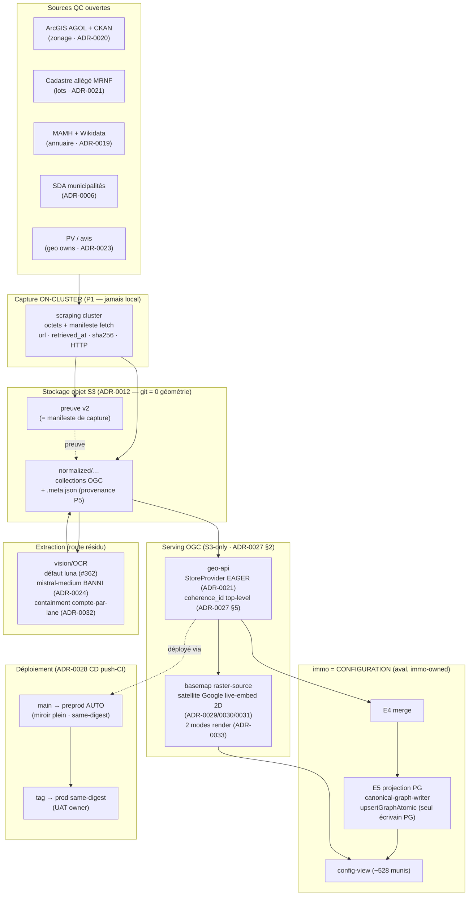

# PIPELINES_GEO — décisions déjà validées, dans leur contexte (input de continuité)

> **But.** Reconstituer le **contexte des décisions geo-pipelines déjà prises et validées**, groupé par
> étape de pipeline, chacune avec son contexte + son statut + son ancrage `file:line` / ADR, plus un
> **schéma end-to-end initial** (annexe). Ce document est l'**input de continuité (#6)** pour l'auteur du
> rebuild pipelines (astra) — **il n'est pas le dossier** : c'est la référence durable qui empêche de
> re-dériver ce qui est déjà tranché.
>
> **Périmètre.** Décisions **geo** (moteur d'acquisition/serving QC). Ce qui relève du **current-state
> cross-projet** — #3 environnements (local/k8s/preprod/prod), #4 creds cloud-code/codex + llm-mesh +
> cluster-mesh, #5 maintenant/après — **n'est PAS couvert ici** (alimenté par i-cond/autres lanes) ;
> seule la part **geo** de ces axes figure (serving-preprod ADR-0027/0028, credential ADR-0032).
>
> **Source de vérité.** `docs/decisions.md` (ADR-0001→ADR-0033). Ce document **agrège et contextualise**,
> il ne remplace pas le journal. En cas d'écart, l'ADR fait foi.
>
> **Convention de statut** (reprise du header `decisions.md`) : `accepted` = ratifié / tranché durable ;
> `proposed` = record rédigé, **pas** ratifié owner ; `superseded` / `revisit`. Un flip `accepted` d'ADR
> owner-gated exige un **record owner-direct capturé** (jamais un relais). Là où une décision **n'existe pas
> en git** (record en scratchpad, ADR sur branche non-mergée), c'est **marqué explicitement** (`measure > infer`).

---

## 0. Cadre & principes fondateurs (transverses — gravés, non ré-ouvrables sans owner)

Ces principes **encadrent tout le pipeline** ; une étape qui les viole n'est pas « faite ».

| # | Principe | Source | Portée pipeline |
|---|----------|--------|-----------------|
| P1 | **Rien ne doit exister uniquement sur une machine.** Toute logique → lib (`packages/`) ; toute donnée captée → stockage objet (S3). **JAMAIS DE CAPTURE LOCALE** : le scraping tourne sur le **cluster** et écrit **directement sur S3** (octets bruts + manifeste `url`/`retrieved_at`/`sha256`/HTTP + logs). Les agents locaux **analysent en lecture seule**, ne captent jamais. | `CLAUDE.md` (principe fondateur) ; `docs/spec/SPEC_CAPTURE_ON_CLUSTER.md` | Acquisition, capture, preuve v2 |
| P2 | **Convergence continue sur `origin/main`.** Aucun travail « fait » tant que non-mergé. **Max 2 PR ouvertes vers `main`.** Garde CI committée (`.github/workflows/max-open-prs.yml`). | `CLAUDE.md` (principe fondateur) | Tout livrable |
| P3 | **Vert par omission = rouge.** Un typecheck/test qui passe parce qu'il ne regarde pas (workspace sauté, fixture absent, `@ts-ignore`) ne prouve rien. On corrige la cause, on n'élargit pas l'angle mort. | `CLAUDE.md` | Toute gate |
| P4 | **Anti-invention.** Entrée manquante → `unknown`, **jamais** devinée. `unknown ≠ complete`. Mesure = complétion-ville / 1106, partitions fermées. Jamais de terme « honnête » — termes factuels (`unknown`/`source-gap`/`unverified`/`partial`/`not covered`). | `CLAUDE.md` (rapport de couverture) | Couverture, extraction, render |
| P5 | **Provenance des données servies.** Toute collection servie porte `zone_source_url` + `zone_source_level`. Écriture additive → `putServedZoneAdditive` (géométrie prouvée inchangée) ; nouvelle géométrie → `putServedZoneGeojson` (**preuve v2 exigée** : url réelle + retrieved_at + sha256). | `CLAUDE.md` (principe de provenance) | Serving |
| P6 | **Anti-laundering des ADR.** Flip `accepted` d'un ADR owner-gated **uniquement** sur record **owner-direct capturé** (verbatim + session-id + horodatage + question fermée) — **jamais** un relais peer ni un say-so conducteur. geo-archi vérifie que le record est genuine à l'ouverture. | `decisions.md` header ; ADR-0030 record | Toute ratification |

**Cadre WP (ADR-0022)** — 7 WP **par artefact servi**, chacun possédant sa donnée + sa preuve + son
compteur : **wp1** cadastre · **wp2** zones · **wp3** reglements · **wp4** pv · **wp5** jointures ·
**wp6** archi (**règles et contrats UNIQUEMENT, pas de code/build**) · **wp7** socle (**BUILD** : kernel
géométrie, geo-lib, kernel de capture, API OGC, npm, pmtiles). **Premier niveau GELÉ** : aucun WP racine
sans accord owner explicite. *Ce document est un livrable wp6 (règles/contrats).*

**Thèse cadrante (owner-directe) — GEO = MOTEUR · IMMO = CONFIGURATION.** immo = une **configuration** de
traitements geo (client configuré dans geo), avec la **nuance de fidélité** : l'assemblage du graphe immo
(**E4** merge + **E5** projection PostgreSQL, seul écrivain PG — `canonical-graph-writer.ts` +
`graph-store.ts::upsertGraphAtomic`) est **immo-owned en aval**, **PAS** aplati en stage moteur.
*Représentation fidèle > thèse lisse.* C'est le frame de lecture du rebuild pipelines (astra).

---

## 1. Fondations données & packages (le socle sur lequel tout le pipeline écrit)

| ADR | Décision | Contexte / ancrage | Statut |
|-----|----------|--------------------|--------|
| **0001** | Track & gouvernance en **fichiers versionnés** (`docs/backlog.md`, `licenses/registry.json`, `docs/decisions.md`). Source de vérité = git, indépendant de la dispo MCP `track`. | MCP `track` indisponible en session. | accepted |
| **0002→0017→0018** | **Taxonomie packages refondue** : sources = **manifestes** (pas de code par source), inventaire injecté, **5 packages** (`geo-core`→`geo`→`geo-sources-americas`/`-europe`/`geo-ui-svelte`), continents chargés par import dynamique optionnel (l'engine **ne dépend d'aucune lib source** → 0 cycle topo). ADR-0018 = exécution (`refactor/packages-v2`, 363 tests, 0 cycle). | ADR-0002 (juridiction+`kind`) **superseded** par 0017 ; migration 16→5 exécutée. | accepted |
| **0003** | Registre de licences **dérivé** de `geo-core.LICENSES` via `resolveLicense()` — jamais saisi à la main ; CI échoue sur dérive. Vue `docs/licenses.md` **générée**. | Gate d'acquisition + registre ne doivent jamais diverger. | accepted |
| **0004** | **Freshness & re-scrape** : `.meta.json.fetchedAt` = fait d'acquisition ; ledger `data/requests/<source>__<dataset>.json` = politique (`updateCadence`, `status`) ; `geo refresh [--stale]` rejoue `acquire`. | Distinguer fait vs politique de re-scrape. | accepted |
| **0005** | **Layout normalisé** `data/normalized/<sourceSlug>/<datasetId>.geojson` + **`FileProvider` récursif** (bug : écriture imbriquée, scan à plat). | Bug détecté par 2 advisors. | accepted |
| **0010 / 0011** | **Budget de données committées** (0010, superseded par 0012) ; **stat/postal non-géométriques** (0011) restent packages taggés `kind` jusqu'à implémentation. | YAGNI sur le split stat/postal. | 0010 superseded ; 0011 accepted |
| **0012** | ⭐ **Données normalisées sur S3** (`sentropic-geo`, Scaleway) — **git ne stocke aucune géométrie**. Seuil : donnée volumineuse → S3 only ; petit référentiel (< seuil) committé. | **Décision de stockage CRITIQUE** — cadre le principe P1 pour la donnée. | accepted |

---

## 2. Acquisition QC (remplir les 1106 municipalités)

| ADR | Décision | Contexte / ancrage | Statut |
|-----|----------|--------------------|--------|
| **0006** | **Municipalités QC (SDA)** P0, **CC-BY 4.0**. | Table de base des 1106 munis. | accepted |
| **0008 / 0009** | **Acquisition bulk GDAL** (0008) ; **revisit `.7z`** (0009). | Volumétrie d'acquisition. | 0008 accepted ; 0009 revisit |
| **0013** | **Capitalisation du scraping immo** sous `@sentropic` (MIT) ; **geo possède l'acquisition** (l'outillage de capture est geo). *Volet PV révoqué par 0023.* | Frontière capitalisation immo↔geo. | accepted (volet PV superseded) |
| **0019** | **Annuaire municipal** `ca-qc/municipal-directory` (MAMH primaire + Wikidata) → table **slug-ville → site officiel** (1100/1106 joints, 99.5 %, CC-BY 4.0). Committé (396 KB < seuil S3). | Pré-requis du domain-probing zonage. | accepted |
| **0020** | **Zonage municipal QC** via **ArcGIS (AGOL) + CKAN** : découverte AGOL → registre `registry.generated.json` (jamais édité main), runner `acquire-arcgis-zonage.ts`, normalisé WGS84 → **S3** `normalized/ca-qc-zonage/<slug>.geojson`. **Acquérir large puis purger** (QC/ON/NB s'imbriquent) → **67 collections / 50 095 features**. | Caveat filtre-QC assumé (point-in-polygon laisse passer des townships ON frontaliers ; purge sur preuve géométrique). | accepted |
| **0021** | ⚠ **Cadastre lots QC servis par shards par ville** `qc-lots-<slug>` (**pas de monolithe** ; monolithe 2,63 Go retiré, données préservées). **Limite connue → tuilage requis (différé)** : le `StoreProvider` est **EAGER** (charge toutes les collections du préfixe au boot) → servir les 40 shards d'un coup **OOM**. On sert **par sous-ensembles** en attendant lazy-load/tuilage. | **Blocage architectural connu** — cause-racine du besoin `?lots=0` côté serving. | accepted (tuilage backloggé) |
| **0023** | **geo possède l'acquisition/indexation/service des PV** (wp4) ; immo reste **consommateur** du graphe (jamais écrivain). **Révoque le volet PV d'ADR-0013.** 5 492 PV indexés, couverture 640/1106. | Contradiction ADR-0013 ↔ SPEC events v2 tranchée (owner). | accepted |

---

## 3. Capture → S3 → preuve v2 (le principe P1 en pratique)

- **Capture-on-cluster** (`SPEC_CAPTURE_ON_CLUSTER.md`, P1) : le scraping tourne sur le **cluster**,
  écrit **directement sur S3** les octets bruts + le **manifeste de fetch** (`url`, `retrieved_at`,
  `sha256`, statut HTTP) + les logs. Une capture qui atterrit sur une machine **n'existe pas** tant
  qu'elle n'est pas sur S3.
- **Preuve par construction (P5)** : le **manifeste de capture EST la preuve v2** exigée par
  `putServedZoneGeojson`. Une preuve non-rattachable à une capture est déclarative, donc sans valeur.
  KPI « preuve v2 exacte » = **0/1106** historiquement, **par défaut de capitalisation** (capture jadis
  locale, irreproductible) — c'est la dette que la capture-on-cluster ferme.
- **ADR-0007** — **hermétisme du cache** (`accepted`) : le cache d'acquisition ne doit pas fabriquer de
  faux vert (P3).
- **Provenance additive vs nouvelle géométrie** (P5) : ré-acquisition **re-stampe dans la même passe**
  (`acquisition/src/zones-*-replace.ts` ; rattrapage `_restamp-served-from-proof.ts`).

*Note `measure > infer` :* le **kernel de capture** (BUILD) est **wp7/socle**, hors de ce périmètre wp6.
Ici on grave la **règle** (capture=donnée de prod, preuve=manifeste) ; l'implémentation appartient au socle.

---

## 4. Serving OGC (l'API depuis S3)

- **S3-only dans le chemin de serving** : geo-api sert la surface **OGC API** depuis **S3 seul**
  (`GEO_DATA_URI`) — le **PostGIS n'est PAS dans le chemin de serving** (ADR-0027 §2). Le PG immo (E5)
  est en **aval**, hors moteur.
- **`StoreProvider` EAGER** (ADR-0021) : charge en mémoire chaque `.geojson` du préfixe au 1ᵉʳ accès
  (parse + index `byId`). ⟹ contrainte de dimensionnement : **servir par sous-ensembles**, tuilage
  différé. C'est la raison d'être du paramètre `?lots=0` (skip `fetchAllLots`) côté vues.
- **Double layout** : geo-api sert le **sous-dossier** quand plat **ET** sous-dossier coexistent →
  stamper/déposer sur **les deux** layouts (`CLAUDE.md`, provenance).
- **`coherence_id` servi** (ADR-0027 §5) : watermark dataset-level exposé en **OGC top-level** sur
  `/collections/<id>` **et** landing `/`, lu **through l'API** par la gate de fraîcheur (un pod stale
  **échoue**, fail-closed).

---

## 5. Extraction vision / OCR (route résidu #362 — discipline €480)

| Réf | Décision | Contexte / ancrage | Statut |
|-----|----------|--------------------|--------|
| **ADR-0024** | **`mistral-medium-latest` (vision-chat Mistral) BANNI** — n'a jamais fonctionné, a causé une facture **480 €** (319 munis en `mistral-vision`). Défaut **supprimé** : un modèle vision doit être **explicite et sanctionné**. Garde gravée `packages/qc-sources/src/sources/vision-engine-policy.ts` (`assertVisionModelAllowed`, `BANNED_VISION_MODEL_PATTERN=/mistral-medium|pixtral/i`) + test CI `vision-engine-policy.test.ts`. **Seul `/v1/ocr` (`mistral-ocr-latest`) sanctionné.** Route vision **intentionnellement inopérante** (échec dur, P3) tant que le remplaçant n'est pas ratifié. | Dérive de code au-delà du décidé. | accepted |
| **#362** (benchmark `bd010c90`) | **Défaut vision = `gpt-5.6-luna`** : 46.5 % publiés ≥0.85 vs `terra` 32.4 %, **0 anti-invention** (les 2), luna **~2.5× plus rapide** (corpus gold `sample-20`, transport codex-CLI). vs `mistral-ocr` = **directionnel** (corpus ≠). geo-archi **ratifie le MODÈLE** (délégation ADR-0024) ; **activation** de la route vision **gatée GATE#1 owner**. | Résolution du remplaçant ADR-0024. | ratifié (modèle) ; activation owner-gated |
| **Reframe OCR** (owner) | OCR/vision via **CLI enrôlée = gratuite** (quota-compte) → cost/page guardrail **MOOT mais SUBSUMÉ** par la containment ADR-0032 (compte-par-lane, 429 fail-closed) — **PAS relâché**. Axe unique = **QUALITÉ**. **4 protections €480 maintenues** (ban + id-explicite + containment-quota + validation-qualité). | `DOSSIER_VISION_OCR_VALIDATION_PROTOCOL.md` (#362, finalisé). | validé |

---

## 6. Credential & containment (périmètre geo explicite — ADR-0032)

> ⚠ **`measure > infer`** : ADR-0032 est **`accepted` (flip `f6fd4211`) mais NON encore mergé sur `main`**
> — il vit sur la branche/PR **#363** (`archi/wp6-adr0032-credential-in-pod`). À traiter comme **décidé
> et ratifié**, mais **pas encore convergé** (P2).

- **ADR-0032 — credential IN-POD, D1 = A** (verdict owner) : le credential vit **dans le pod** ; la
  **containment ne peut PAS vivre in-pod** (self-enforced = contournable) ni au gateway (ne mesure pas ce
  qui le contourne) ⟹ containment = **compte enrôlé PAR LANE** (quota externe = cap ; révocation de compte
  externe = kill-switch). Sous A, le pod appelle le provider **en direct** (0 gateway ; base k8s = 0
  gateway ; seul le daemon host-side `:3002` = forme B, **exclue** par D1=A).
- **codex = CLI-direct** (`auth.json`) ; **gemini = in-pod-direct** via `cloud-code-transport.ts`
  (`buildCloudCodeRequest`, exige `cloudaicompanionProject`, UA `antigravity/cli/1.1.10`).
- **`8aee7f615`** (`provider-connections.ts:1139-1140`) = **cause directe** de la classe d'échec €480
  gemini : l'enrôlement passe **sans** `cloudaicompanionProject` → le transport **lève à l'appel**. Le 3ᵉ
  terme (fallback `selectAccountWithFallback`) est **MOOT** avec le binding per-lane.
- **Record** : attestation **1re main i-cond** (session `session_016HbmM38GS7JcSCWVVRaVVW`), view-ref
  Artefact `0a947e61` (`f3d77dab`). Flip tenu sur record genuine (P6).

*Hors périmètre geo (→ i-cond/autres lanes)* : le détail cross-projet #4 (llm-mesh / cluster-mesh /
comptes cloud-code/codex à l'échelle mesh). Ici, seule la **règle de containment geo** figure.

---

## 7. Moteur carto & render / basemap (chaîne satellite 2D)

| ADR | Décision | Contexte / ancrage | Statut |
|-----|----------|--------------------|--------|
| **0014 / 0015 / 0016** | **Composant carte WebGL** + builders **`dataviz-core`** (bins neutres). | Base carto. | accepted |
| **0025** | **Moteur carto geo RENDERER-NEUTRE (geo-owned)**, package TS pur agnostique, N adaptateurs minces DS-owned, **zéro-copie** ; renderer-neutre dès v1 (2D maplibre + 3D Cesium/deck) ; **gel §1 gaté sur DÉMO 3D concrète**. | Vue mutualisée geo↔immo. Boundary : §1 seam = geo ; §2–6 = DS. | accepted |
| **0026** | **Gel du seam moteur v1** (ratifié owner) — gagné **sur preuve** au gate §9 (re-run deck.gl `b67eb222` VERT : §1.5.1 zoom normalisé 7/7 dans les octets, 0 expression maplibre). Toute évolution du seam gelé = **semver + ADR**. | Doctrine « gel gagné sur preuve ». | accepted (ratifié owner) |
| **0029** | **Adoption v2.0 basemap** : nouveau membre `raster-source` **additif pur** (v1 intact) ; `RasterSource` **abstrait** (provider-neutre) ; `AttributionSpec static|dynamic` ; `policy: live-embed-only|cacheable` **requise** (garde+test committés) ; canal `onError`. | MAJOR requis par la règle 0026 (seam gelé). | **`proposed`** (pas ratifié owner) |
| **0030** | **ODbL-reversal** : fond satellite **Google live-embed 2D** (Voie A) supersède la posture blank-ODbL-safe (`GeoMap.svelte:292`), corrige le trap `attributionControl:false` (`:305`). Tuiles **navigateur→Google en direct**, jamais capturées sur S3 (distinct de P1 : embed vif ≠ capture). | **Record owner-direct capturé** (P6) : session `session_01BoKz6A5PUiLxg4shntStXu`, 2026-09-04, verbatim « Oui — j'autorise GO#1 ». | accepted (record genuine) |
| **0031** | **§5 mint côté CLIENT (B)** : l'endpoint geo-api devient un **descripteur public flag-gaté** `{key,mapType,…}` (0 appel serveur→Google) ; l'adaptateur fait `createSession`+tuiles côté navigateur. Préserve l'**isolation A2** (netpol serving = kube-dns + S3-BHS only). **GEL mini-gate ratifié** (3/3 cold loads : tuiles peignent, attribution dynamique « ©2026 NASA », 0-S3/0-OSM). Alternative A (mint serveur) rejetée (brèche A2). | Mesuré : server-mint = 502 `BasemapMintFailed` (egress geo-api→Google jamais prévu). | accepted |
| **0033** | **Basemap satellite = DEUX modes distincts** : **SATELLITE** = surfaces **transparentes/contour** (imagerie visible à travers, **0 aplat opaque**) ; **PLAN** = aplats remplis. Amende ADR-0030:714-715 (« les couches data continuent de porter le sens » = l'inverse). Contour **family-color** (kind→category) ; family-less = **neutre** (P4 anti-invention). Boutons de switch de layer requis. Boundary ADR-0025 : tokens couleur exacts = DS ; règles per-mode + styling casing/dash = **geo-owned**. | **Record owner-direct** (P6) : session `session_016HbmM38GS7JcSCWVVRaVVW`, verbatim « deux modes bien distinct… pas mettre des applats non transparents sur satellite ». | **accepted (ratifié owner) — NON mergé** (branche `archi/wp6-adr0033-satellite`) |

> ⚠ **`measure > infer`** : ADR-0033 est **ratifié owner** mais vit sur **branche non-mergée** (PR différée,
> cap ≤2 PR — P2). Les **décisions render-owner de finalisation** (casing 0.85 uniforme, dash family-less
> SKIP, neutre per-mode satellite-contour/plan-fill) sont en **scratchpad**
> (`adr0033-render-finalization-footnotes.md`), **pas encore gitées** — à folder au PR ADR-0033 post-merge #363.

---

## 8. Déploiement & serving preprod (périmètre geo explicite — ADR-0027/0028)

| ADR | Décision | Contexte / ancrage | Statut |
|-----|----------|--------------------|--------|
| **0027** | **geo-preprod = tier de serving preprod** (ratifié owner). Invariants gravés : **(1) namespace-par-env** (`geo-preprod`, RBAC/secrets/quota isolés) ; **(2) serving S3-only** (PostGIS hors chemin → 1 pod geo-api-preprod, 0 PVC) ; **(3) bucket S3 séparé** (OVH-BHS ; sens-unique §6.1 au niveau credential/bucket) ; **(4) promotion same-digest** (re-pointe le MÊME digest, jamais rebuild ; cible GHCR-by-digest) ; **(5) `coherence_id` servi** (watermark OGC top-level, gate fraîcheur fail-closed) ; **(6) parité = MIROIR PLEIN** (EXACTEMENT le set prod = **3885 collections** dont ~1088 slug-nu, **pas** une whitelist de familles — sinon faux vert). | immo-preprod consomme **geo-preprod** (jamais geo-prod), même point de cohérence. | accepted (ratifié owner) |
| **0028** | **geo adopte le CD plateforme (push-CI apply)** : **`main` → deploy AUTO preprod** (job `deploy-preprod`, SA least-priv ns-scopé, digest post-merge) ; **tag → promotion prod same-digest** (gaté `PREPROD_ACCEPTANCE` + UAT owner) ; manifests **Kustomize** base+overlays ; **secrets = SealedSecrets** (minté 1× → scellé → committé → long-vécu + rotation ; ferme le gap « creds live-only »). **Supersede le volet MANUEL d'ADR-0027 §8** ; invariant same-digest **préservé**. | Owner a gelé le déploiement manuel, demandé l'adoption du CD plateforme (fork O1 = push-CI). | accepted (ratifié owner) |

*Hors périmètre geo (→ autres lanes)* : le détail #3 environnements cross-projet (topologie k8s complète,
DNS, cert-manager) et #5 maintenant/après. Ici, seuls les **invariants de serving-preprod geo** figurent.

---

## 9. État git récapitulatif (`measure > infer`)

Ce qui est **convergé** (`origin/main`) vs **décidé-mais-non-mergé** vs **non-gité** — pour qu'astra ne
confonde pas « ratifié » et « en git » (P2).

| Décision | Statut décision | En git ? |
|----------|-----------------|----------|
| ADR-0001 → 0031 | accepted / proposed (0029) / superseded (0002,0010) / revisit (0009) | ✅ `origin/main` (`docs/decisions.md`) |
| **ADR-0032** credential-in-pod D1=A | accepted (flip `f6fd4211`) | ⏳ **PR #363**, non mergé |
| **ADR-0033** satellite 2-modes | accepted (ratifié owner) | ⏳ branche `archi/wp6-adr0033-satellite`, **PR différée** (cap ≤2 PR) |
| **#362** défaut luna | ratifié (modèle) ; finalisé dans le dossier | ⏳ PR #364 (dossier), ADR-de-suivi ADR-0024-luna **à écrire** post-merge #363 |
| **Render footnotes** (casing 0.85 / dash SKIP / neutre per-mode) | décidé (render-owner) | ❌ **scratchpad seul** — à folder au PR ADR-0033 |

**PR ouvertes (cap 2)** : #363 (ADR-0032), #364 (#362-luna). ADR-0033 en attente d'headroom.

---

## 10. Schéma end-to-end initial (annexe — squelette, à enrichir par astra)

Vue **geo-first** : le **moteur** (acquisition → capture → S3 → serving OGC) ; immo = **configuration** en
aval (E4/E5 immo-owned, fidélité). Un seul schéma-racine ; astra le décompose par composant.

**Légende de lecture pour astra** : les arêtes `-.preuve.->` et `-.déployé via.->` sont des **invariants
transverses** (P5 provenance, ADR-0028 CD), pas des flux de données. Le bloc **IMMO** est **en aval du
moteur** — nuance de fidélité owner (E4/E5 immo-owned, non aplatis dans le moteur). Ce squelette est
**initial** : chaque sous-graphe mérite son schéma-composant dans le rebuild (astra).

---

### Ce que ce document NE couvre PAS (renvoi cadrage geo-cond)

- **#3 environnements** (local/k8s/preprod/prod cross-projet), **#4 creds** (cloud-code/codex + llm-mesh +
  cluster-mesh à l'échelle mesh), **#5 maintenant/après** = **current-state cross-projet**, alimenté par
  i-cond/autres lanes pour astra. Seule la **part geo** de ces axes figure ici (serving-preprod
  ADR-0027/0028 §8 ; règle de containment ADR-0032 §6).
- **Le BUILD** (kernel géométrie/capture, adaptateurs moteur carto, garde policy) = **wp7/socle**, hors
  wp6. Ce document grave les **règles et contrats**, pas leur implémentation.
