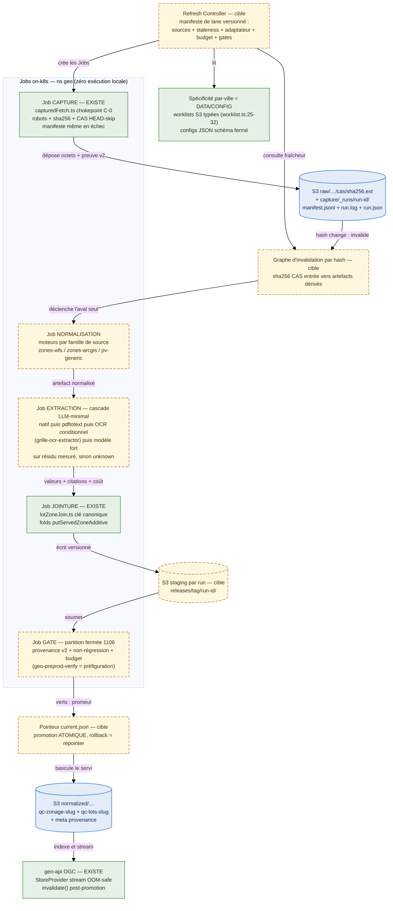

# SPEC — Architecture cible des pipelines de données geo

> **Capitalisation geo-archi (WP6)** de la cible produite par **claude-fable-5** (2026-08-21, groundée
> `fichier:ligne` sur le repo). **Complément du dossier de DÉCISION** `docs/spec/DOSSIER_PIPELINES_SYNTHESIS.md` :
> le dossier = la DÉCISION (Option B strangulation + 4 décisions cibles, ratification owner) ; **ce spec = la
> CIBLE PRÉCISE** (par-pipeline, traitements, environnements+infra, 3 vues). Track `01M0GWZW2753PV92WJ2PGX5GS2`.
>
> **RATIFIÉ (2026-08-22)** : Track décision `01M0JAMM5YWV1ZH8D6R47RA9A8` **outcome=go** — Option B + 4 décisions
> cibles. WP de migration `01M0N3PGJPY3FK8Y3ACXNV17A8` (accountable rhanka ; responsible geo-archi + geo-socle).
> **Amendement owner** gravé au **§A** ci-dessous — *le formalisme d'architecture précède le plan old→new* :
> DAG-first + LLM piloté par le DAG, `llm-mesh enroll`, moteur LLM sur sentropic (pattern à trancher),
> tout-sur-k8s, tronc commun `geo-socle`.
>
> **Direction ratifiée** : Option B (strangulation incrémentale par lanes) + 4 décisions cibles — (1) moteur
> COMMUN de refresh piloté par manifestes ; (2) refresh-on-k8s (zéro exécution locale) ; (3) LLM-minimal
> (cascade natif→texte→OCR conditionnel→modèle fort sur résidu mesuré) ; (4) cycle preprod↔prod automatisé
> (merge→miroir+prune+upgrade ; tag→rejeu réel+backup+promotion atomique).
>
> **Légende** : `EXISTE` = composant vérifié dans le repo (cité `fichier:ligne`, mergé sur `origin/main` sauf
> mention contraire). `[cible]` = composant à construire, décidé par la direction ratifiée. `[unknown]` = non
> vérifiable depuis le repo — jamais inventé.

---

## A. Cadre d'architecture ratifié — le formalisme précède le plan

> **Le formalisme d'architecture PRÉCÈDE le plan old→new** (exigence owner). Track `01M0JAMM…` outcome=go. Ces
> cinq éléments-cadre s'appliquent **au-dessus** des 8 pipelines (§1) ; les §2–§4 les déclinent (traitements,
> environnements+infra, écarts). Grounding marqué **explicitement** — les concepts d'infra hors repo geo sont
> `[cible]` / `[unknown côté repo geo]`, jamais présumés.

**A.1 — DAG-first ; le LLM est piloté PAR le DAG (jamais l'inverse).** L'unité d'architecture est un **DAG de
transformations** par lane (capture → normalisation → extraction → jointure → gate → promotion), invalidé par
**hash des entrées** (§2.2 étape 7 ; §2.3). Un nœud PEUT invoquer un modèle, mais **le DAG décide quand et si**
l'appel a lieu, quelles villes, quelles reprises. **Aucun agent-LLM n'ordonnance, ne choisit les villes, ni ne
décide des reprises.** Statut : `[cible]` — le graphe d'invalidation par hash (§2.2/§2.3) est le socle
existant-en-préfiguration ; l'ordonnanceur DAG explicite reste à construire.

**A.2 — LLM minimal via `llm-mesh enroll`.** Tout appel modèle passe par un **`llm-mesh`** à comptes **enrôlés**
(codex + claude + gemini), usage **minimal** et **instrumenté** (provider / model / prompt-version / input-hash /
output-key / coût — cf. §1.2 LLM-minimal). Le mesh est le **seul** point d'accès LLM du pipeline ; un échec de
gate ⇒ `unknown`, **jamais** une 2ᵉ passe modèle pour fabriquer un vert. Statut : `[cible]` — pattern d'accès
ratifié owner ; l'enrôlement des comptes + le routage mesh restent à implémenter. `git grep 'llm-mesh'` sur le
repo geo = **0** ⇒ **`[unknown côté repo geo]`** : concept d'infra transverse, spécifié hors geo, non présumé ici.

**A.3 — Moteur LLM hébergé sur `sentropic` — PATTERN À TRANCHER.** Décision d'architecture **ouverte**
`[cible — à trancher]` : le moteur LLM tourne sur l'infra **sentropic** selon **l'un de deux patterns** —
**(a) cluster-mesh** (le moteur vit dans un mesh inter-cluster) **vs (b) service `sentropic-sentech`** (un
service adressé). À **arbitrer par l'owner / geo-socle** avant l'industrialisation de l'extraction : conditionne
netpols (egress par-lane), latence et coût. Aucun des deux n'est présumé dans ce spec. `git grep` geo :
`cluster-mesh` / `sentropic-sentech` = **0** ⇒ **`[unknown côté repo geo]`**. → écart §4.6.

**A.4 — Tout sur k8s, sans exception — y compris refresh PV / règlements / grilles.** Zéro exécution de
production hors cluster : **PV** (canari), **règlements**, **grilles-normes**, **zones**, **cadastre/rôle**,
**immo-lots** = Jobs/CronJobs k8s (§3.2, §3.4). Décommission explicite (§3.2 « à décommissionner ») : Serverless
Scaleway `deploy/normes-job`, orchestrateur local `deploy/acquisition-job` (`k8s-shard-run.ts` lancé du poste),
flotte tmux `geo-fleet.ts` comme **moteur de refresh**. Les agents locaux restent **analystes lecture-seule**
(CLAUDE.md). Statut : contrat on-k8s **EXISTE** (capture/PV) ; généralisation par-lane `[cible]`.

**A.5 — Tronc commun `geo-socle` ; le spécifique-par-ville est lui-même mutualisé.** La logique se capitalise
dans un **tronc commun** (`packages/`, **responsable geo-socle**) : moteurs par **famille de source** (§1.1),
capture `capturedFetch` (§2.2 étape 2), jointure `lotZoneJoin` (§2.2 étape 6), serving `StoreProvider` (§2.2
étape 11). Le « spécifique-par-ville » n'est **pas N implémentations sur-mesure** : c'est une **worklist S3 +
config JSON validée par schéma fermé** (§1.2) — donc **mutualisé** : une famille sert M villes, la variation =
**data, pas code**. Un runner par slug est un anti-pattern ; critère de renversement = >15 % des sources actives
exigeant un escape-hatch par ville (§1.2). Statut : moteurs par famille **EXISTE** (§2.2 étape 4) ; promotion
complète en lib geo-socle + route par le contrôleur `[cible]`.

---

## 1. Cibles de pipeline (8 pipelines × moteur commun)

### 1.1 Table de synthèse

| Pipeline | Moteur commun applicable | LLM-cible | Refresh-cible | Spécificité par-ville = data/config |
|---|---|---|---|---|
| **zones** | OUI — capture `capturedFetch`/worklist + moteurs par **famille de source** (WFS, ArcGIS, JMap, fichier vectoriel, plan PDF) enregistrés dans `packages/` | **Zéro** sur SIG/WFS/ArcGIS. Vision (labels géoréf t1/t2 : `acquisition/src/lib/t1-labels-claude.ts`, `lib/t2-labels-gpt55.ts`, `t2-autogcp.ts`) **réduite au résidu glyphique** après texte/vectoriel/cadastre | CronJob de détection staleness + Jobs worklist on-k8s ; preuve v2 mécanique via `captureProofFields` (`manifest.ts:338-366`) | Manifeste par ville : endpoint/layer/field/CRS — jamais un runner par slug |
| **normes** | OUI — capture grille/règlement en CAS ; extracteurs = moteurs enregistrés (`grille-ocr-extractor.ts`, parsers natifs `grille-*-parser.ts`) | Cascade : natif → OCR Document-AI conditionnel (`packages/qc-sources/src/sources/grille-ocr-extractor.ts:1-40`, ~1 $/1000 pages) → modèle fort **uniquement** sur résidu mesuré. Supprimer le défaut `both` de `zonage-norms-2engine-keepbest.ts` ; vision Mistral-chat BANNIE (ADR-0024, `vision-engine-policy.ts`) | onk8s-job conditionnel (ETag/hash de document), remplace le Serverless Scaleway hors-cluster (`deploy/normes-job/README.md:1-31`) et le staging local | Config : type de grille, pages, version — validée par schéma fermé |
| **PV** | OUI — **canari n°1** : CronJob index EXISTE déjà, le contrat worklist couvre la lane | Aucun par défaut : parse HTML/index + `pdftotext` déterministes ; OCR (`acquisition/src/lib/pv-ocr-artifact.ts`) seulement si score-texte insuffisant ; artefact OCR durable S3 | Étendre `geo-pv-refresh` (quotidien, index seul — `acquisition/src/pv-index-run.ts:11-13`) à la **capture des documents + extraction** ; campagnes par CronJob à état S3 (`deploy/capture-job/cronjob-capture-refresh.yaml:1-4`) | Registre de villes : sortir du TS monolithe (>4500 lignes, cf. dossier sol §3 PV) vers données validées |
| **règlement** | OUI — worklist des documents officiels + CAS ; fold commun EXISTE (`acquisition/src/fold-reglement-to-zonage.ts:1-23`, 4 champs verbatim, anti-invention) | Regex/texte + OCR sur scan ; modèle **propose** seulement sur numéro/millésime ambigu, avec citation obligatoire — remplace l'agent-opérateur de la flotte (`acquisition/config/fleet.json:10`) | Job on-k8s déclenché par changement de document (hash de registre) | Registre curé committé (`acquisition/config/reglement-provenance.json`) = data ; veto fermé |
| **usage dominant** | OUI — réutilise la capture règlement/légende ; fold longest-prefix EXISTE (`acquisition/src/fold-usage-dominant.ts:9-25`) | Le runtime est **déjà déterministe** (map préfixe→catégorie). Le modèle ne sert qu'à **proposer** un nouveau map (légende inédite) ; revue puis exécution déterministe | Rejouer seulement si légende, zones ou map changent (invalidation par hash) | `acquisition/config/usage-dominant-map/<slug>.json` = data (déjà le cas) |
| **effet densifiant** | OUI — capture des **deux versions juridiques** ; réutilise le moteur normes ×2 + **diff numérique commun [cible]** | Aucun LLM ne décide le signe : extraction de chaque version par la cascade normes, comparaison numérique ; modèle sur cellule illisible seulement | Job on-k8s déclenché par nouvelle version de règlement (événement PV) — pas de grind agent (lane à 0 shard, `fleet.json:13`) | Schéma avant/après + statut légal = data ; `inconnu` conservé (fold anti-invention `fold-effet-densifiant.ts`) |
| **cadastre/rôle** | OUI — crawl provincial + rôle annuel en worklists (`packages/geo-sources-americas/`), sources structurées | **Aucun** (XML/ArcGIS structurés) | Jobs on-k8s calendaires/événementiels (publication provinciale, rôle annuel) | Data ; **pré-requis : arbitrage owner frontière Loi 25 du rôle** (contradiction fetch-only lib vs parse dans `lots-enriched-run.ts`, dossier sol §11.8) [unknown tant que non arbitré] |
| **immo-lots** | OUI — le meilleur moteur transverse EXISTE : `packages/geo/src/zonage/lotZoneJoin.ts` (clé canonique :78-120 ; méthodes `area-majority`/`centroid-fallback`/`unassigned` :22-31) | **Aucun** (géométrie, identifiants, point-in-polygon) | Porter le backfill local (`fleet.json:18-22`, session tmux) **tel quel** en Job k8s, puis déclenchement par hashes amont (zones/normes/cadastre/rôle) ; promotion atomique de `qc-lots-*` | Aliases/mappings sortis du code vers config ; partition fermée 1106 par produit |

### 1.2 Règle transversale (les 4 décisions appliquées)

- **Moteur commun** : la variation municipale devient *worklist S3 + config JSON validée par schéma fermé*. Une
  exception est une **implémentation de moteur par famille de source dans `packages/`**, jamais un script par
  slug. Critère de renversement (dossier sol §6) : >15 % des sources actives exigeant un escape-hatch par ville
  après le canari PV + 2 familles zones.
- **LLM-minimal** : chaque appel modèle est instrumenté (provider/model/prompt-version/input-hash/output-key/
  coût) ; échec de gate ⇒ `unknown`, jamais une seconde passe modèle pour fabriquer un vert. Zéro appel sur
  cadastre/rôle, immo-lots, jointures, serving.
- **Refresh on-k8s** : zéro refresh de production depuis `geo-fleet`/tmux/laptop ; images épinglées **par
  digest** (déjà le contrat : `cd-preprod.yml:64-79`, `docker-publish.yml:164-195`).
- **Data/config** : les folds règlement/usage/effet passent tous par `putServedZoneAdditive` (géométrie prouvée
  inchangée, whitelist de props) — inchangé en cible.

---

## 2. Architecture des traitements (cible)

### 2.1 Le Refresh Controller commun `[cible]`

Un contrôleur (CronJob on-k8s + lib dans `packages/`) lit un **manifeste de lane versionné** (S3 + committé) :
inventaire de sources, politique de staleness, adaptateur de capture, route de normalisation/extraction,
dépendances de jointure, ressources/budget, gates, clé de sortie. Il **crée des Jobs k8s** ; le code municipal
est interdit dans le runtime. Séquence de migration (Option B) : PV (canari) → zones ArcGIS/WFS → règlement+usage
→ normes (après cascade LLM-minimal) → effet/cadastre/immo.

### 2.2 Un refresh bout-en-bout — composants réels vs [cible]

| Étape | Composant | Statut |
|---|---|---|
| 1. Manifeste | Contrat worklist typé `{slug, source, urls}` + sharding déterministe — `packages/qc-sources/src/capture/worklist.ts:25-32,44-54` ; worklists committées/S3 (`deploy/capture-job/worklists/`) | EXISTE (contrat) / [cible] (manifeste de lane enrichi : staleness, budget, gates) |
| 2. Capture | Chokepoint unique `capturedFetch` — robots, chaîne de redirections, sha256 streamé, dépôt CAS HEAD-skip, **ligne de manifeste même en échec** (`capturedFetch.ts:207-497`) ; écrit UNIQUEMENT sous `raw/` + `capture/_runs/` (`manifest.ts:184-194`) ; capture = donnée de prod sur S3, jamais locale | EXISTE |
| 3. Preuve | Manifeste de run → preuve v2 **mécanique** (`captureProofFields`, `manifest.ts:338-366` : url réelle + retrieved_at + sha256, refus si rédigé/sans octets) | EXISTE |
| 4. Normalisation | Moteurs par famille (zones WFS/ArcGIS : `acquisition/src/zones-*-replace.ts` ; PV : `proces-verbaux-generic.ts` ; cadastre : `geo-sources-americas`) | EXISTE (par famille) / [cible] (promotion complète en lib + route par le contrôleur) |
| 5. Extraction | Cascade LLM-minimal : natif → `pdftotext` → OCR conditionnel (`grille-ocr-extractor.ts`, backend-paramétrable `resolveOcrConfig`) → modèle fort sur résidu borné, sortie en artefact S3 | EXISTE (briques) / [cible] (routeur commun à score d'insuffisance, suppression du défaut `both`) |
| 6. Jointure | `lotZoneJoin.ts` (clé canonique = source unique de vérité, :88-120) + folds additifs `putServedZoneAdditive` | EXISTE |
| 7. Invalidation | **Graphe d'invalidation par hash** : sha256 CAS des entrées → artefacts dérivés ; un hash inchangé ⇒ étape sautée (le HEAD-skip CAS et l'idempotence des folds préfigurent) | [cible] |
| 8. Staging | Écriture versionnée par run : `preprod/runs/<merge-sha>/<run-id>/`, `prod/releases/<tag>/<run-id>/` — jamais d'écriture directe dans le baseline servi | [cible] |
| 9. Gate | Jobs on-cluster : partition fermée 1106, provenance v2, non-régression, budget. Le Job `geo-preprod-verify` (parité set_hash via API, read-only) **préfigure explicitement** cette archi (`deploy/k8s/preprod/geo-api-preprod-verify-job.yaml:7-16`) | EXISTE (verify) / [cible] (généralisation par lane) |
| 10. Promotion | Pointeur `current.json` promu atomiquement ; rollback = repointer. `coherence.json` + `computeSetHash` (`packages/geo/src/preprod/mirror.ts`) = le mécanisme existant à généraliser | EXISTE (coherence preprod) / [cible] (pointeur de release servi) |
| 11. Serving | `StoreProvider` OGC : index méta d'abord, stream OOM-safe, règle sous-dossier-sur-plat (`store-provider.ts:61-207,267-278`), préfixe `normalized/` ; `invalidate()` (:77-79) = le hook de bascule post-promotion | EXISTE |

### 2.3 Vue A — Architecture de traitement cible

---

## 3. Environnements & infrastructures (cible)

### 3.1 Les trois environnements et le cycle owner

| Env | Rôle | Composants (statut) |
|---|---|---|
| **dev** | Analyse **lecture seule** (agents locaux ne captent jamais — CLAUDE.md) ; scripts committés ; rapport portfolio (`scripts/portfolio-city-report.mjs`) | EXISTE. La flotte tmux (`acquisition/src/geo-fleet.ts:1-20`, `fleet.json`) est **à retirer du chemin de production** [cible : décommission après strangulation] |
| **preprod** | ns `geo-preprod` — teste le **pipeline** sur un miroir des données prod | EXISTE (mergé origin/main) : CD auto + sync/verify + SealedSecrets + netpols (détail 3.2) |
| **prod** | ns `geo` — les vraies données, servies `api.geo.sent-tech.ca` | EXISTE (serving, CronJob PV index) ; release-prod tag-driven [cible] |

**Merge sur `main` (jambe 1 — EXISTE + [cible])** :
1. `cd-preprod.yml` (EXISTE, `origin/main`) : path-filtré (`packages/geo/**`, `Dockerfile`, `deploy/k8s/base/**`,
   `overlays/preprod/**` — `:13-23`) → build geo-api → **digest immuable** (`:64-79`) → assert digest en registry
   (`:97-100`) → `make k8s-deploy-preprod GEO_DIGEST=…` = kustomize set image + `kubectl apply -k` + rollout
   status (`:102-104`) → diagnostics auto sur échec (`:110-127`).
2. **Miroir data prod→preprod** : Job `geo-preprod-sync` (EXISTE, `deploy/k8s/preprod/geo-api-preprod-sync-job.yaml:49-114`)
   — source prod **read-only** (`S3_SOURCE_*`, secret `geo-s3-credentials-prod-ro`), dest preprod RW ; miroir
   **EXACT avec prune** (`packages/geo/src/preprod/mirror.ts` : `MirrorPlan.deletes`, garde anti-mass-delete =
   refus de pruner sur listing source vide) ; stampe `coherence.json` (`served_count` + `set_hash` fail-closed,
   `coherence_id` partagé cross-repo immo). Aujourd'hui appliqué par poc-k8s en **fenêtre gatée**
   (`overlays/preprod/kustomization.yaml:3-5`), pas à chaque merge — [cible] : déclenchement automatisé au merge.
3. **Gate** : Job `geo-preprod-verify` (EXISTE, `geo-api-preprod-verify-job.yaml`) — parité via l'API (jamais S3
   direct), même `computeSetHash` que le sync (zéro dérive).
4. **Essais pipeline** en preprod : écrits sous `preprod/runs/<merge-sha>/<run-id>/`, jamais dans le baseline [cible].

**Tag `v*` (jambe 2 — EXISTE + [cible])** :
1. `docker-publish.yml` (EXISTE) : tag-driven only (`:9-18`) → image geo-api (Scaleway + miroir GHCR `:110-121`) ;
   image `geo-capture` **GHCR uniquement, épinglée par digest** (`:143-195`). `npm-publish.yml` (EXISTE) :
   tag-driven, verify → release-guard → publish (`:6-9`).
2. `release-prod` [cible] : le tag référence un **digest déjà validé en preprod** (same-digest —
   `overlays/prod/kustomization.yaml:13-17`, résolveur marqué plateforme-pending `:2-4`) ; aucune reconstruction.
3. **Backup + restore-drill** [cible] : inventaire/versionnement des objets prod, sauvegarde du pointeur, test de
   restauration automatisé AVANT mutation.
4. **Rejeu RÉEL** [cible] : les vraies captures/normalisations/extractions/jointures tournent en Jobs k8s sous
   `prod/releases/<tag>/<run-id>/`. **Aucune donnée calculée en preprod n'est copiée en prod** — preprod prouve
   le code, le tag rejoue les sources.
5. **Promotion atomique** [cible] : bascule du pointeur `prod/current.json` après gates ; rollback = repointer
   l'ancienne release.

### 3.2 Infrastructure

**k8s (cluster poc)** — EXISTE sauf mention :
- ns `geo` (prod) : Deployment `geo-api` (base kustomize `deploy/k8s/base/deployment.yaml` — port 8787, probes
  `/conformance` `:55-74`, image retargetée par digest `:36-39`, `GEO_DATA_URI` patché par overlay `:47-50`) ;
  CronJob `geo-pv-refresh` quotidien 04:20 (`deploy/k8s/geo-pv-refresh-cronjob.yaml:11,33-35` — ⚠ **non tracké**,
  working tree seulement : défaut de capitalisation à committer) ; CronJobs de campagne capture à état S3,
  `*/2 min`, lease + quota + auto-suspend (`deploy/capture-job/cronjob-capture-refresh.yaml:52-98`) ;
  `tenant-quota.yaml`. Refresh Controller [cible] s'ajoute ici.
- ns `geo-preprod` : Deployment `geo-api` (overlay `overlays/preprod/` — ingress `api.preprod.geo.sent-tech.ca`
  `:33-42`) ; Jobs `geo-preprod-sync` / `geo-preprod-verify` ; RBAC ns-scoped `deployer-preprod-rbac.yaml` (SA
  `geo-ci-deployer-preprod`).
- **SealedSecrets** (EXISTE) : `overlays/preprod/sealed-secrets.yaml` — `geo-s3-credentials-preprod` (dest RW) +
  `geo-s3-credentials-prod-ro` (source RO), scellés bitnami au nom exact ns+name, plaintext jamais dans le repo.
  Prod : secret `geo-s3-credentials` référencé par les CronJobs (`cronjob-capture-refresh.yaml:100-101`)
  [méthode de provision : unknown côté repo].
- **NetworkPolicies** (EXISTE) : serving preprod = egress default-deny + DNS + S3-BHS `54.39.60.208/32:443`
  (`overlays/preprod/netpol.yaml:32-51`) — le serving preprod ne peut PAS joindre la prod ; ingress limité
  traefik/kube-system + `radar-immobilier-preprod` (`:52-77`) ; le Job sync est la **seule** jambe autorisée vers
  la prod-API `51.79.100.177/32:443` (`geo-api-preprod-sync-job.yaml:12-47`). [cible] : mêmes netpols par-lane
  pour les Jobs du Refresh Controller (egress source-du-manifeste seulement).
- État live du cluster (CronJobs réellement armés, Jobs appliqués, controller bitnami) : **[unknown]** depuis le
  repo — le repo porte les manifests, pas le readback. [cible] : réconciliation GitOps/readback.

**S3 (stockage objet)** :
- Buckets : prod `sentropic-geo` (`store-provider.ts:7`) ; preprod `sentropic-geo-preprod`
  (`overlays/preprod/patch-serving.yaml:12-16`). Endpoint épinglé côté netpol = S3 BHS OVH
  (`s3.bhs.io.cloud.ovh.net`, `netpol.yaml:45`) ; le docstring StoreProvider cite encore Scaleway (ADR-0012) —
  l'endpoint effectif est porté par les secrets par-env [unknown depuis le repo seul].
- Layout : `raw/<source>/cas/<sha256>.<ext>` (content-addressed, `manifest.ts:52`) +
  `capture/_runs/<run-id>/{manifest.jsonl,run.log,run.json}` (`manifest.ts:163-174`) = les DEUX seuls préfixes
  ouverts à la capture (`:184-194`) ; `normalized/…` = le servi (collections OGC `qc-zonage-<slug>` /
  `qc-lots-<slug>`, provenance `zone_source_url` + `zone_source_level` par collection) ;
  `registry/qc-pv/<slug>/index.json`, `registry/qc-zonage-norms/…` (registres) ; `sources/qc-zonage-grilles/`
  (staging normes — à résorber [cible]). [cible] : `preprod/runs/…`, `prod/releases/…`, pointeurs `current.json`.
- Provenance : preuve v2 = url réelle + retrieved_at + sha256, dérivée mécaniquement de la capture ;
  `putServedZoneGeojson` (nouvelle géométrie, preuve exigée) / `putServedZoneAdditive` (fold, géométrie inchangée
  octet-pour-octet).

**Registry** : Scaleway `rg.fr-par.scw.cloud/sentropic-geo/geo-api` (+ miroir `ghcr.io/rhanka/geo-api`) ;
`ghcr.io/rhanka/geo-capture` (GHCR only, par digest) ; `sentropic-geo/geo-acquisition:0.1.0` (Scaleway — tag
mutable, [cible] : digest).

**Serving OGC** : geo-api (Hono + `StoreProvider`) sert `/collections` depuis `s3://<bucket>/normalized` — index
méta sans parse des corps, stream borné, règle sous-dossier-sur-plat (`store-provider.ts:252-278`). Consommateur
interne : radar-immobilier (preprod : FQDN `geo-api.geo-preprod:8787`). Les Jobs in-cluster appellent le
**service ClusterIP**, jamais le LoadBalancer public en hairpin.

**À décommissionner (chemin non-cible)** : Serverless Scaleway `deploy/normes-job` (hors cluster, staging local
recommandé — `README.md:22-34`) ; orchestrateur local `deploy/acquisition-job` (`k8s-shard-run.ts` lancé du
poste — `README.md:29-40`) ; flotte tmux `geo-fleet.ts` comme moteur de refresh (les agents restent des
analystes lecture-seule).

### 3.3 Vue B — Cycle environnements

```mermaid
%%{init: {"theme":"base","themeVariables":{"fontSize":"12.5px","fontFamily":"IBM Plex Sans, sans-serif"}}}%%
flowchart LR
  classDef existe fill:#e7f0e7,stroke:#2e7d32,color:#173517
  classDef cible fill:#fff6e0,stroke:#b26a00,color:#4a3200,stroke-dasharray:6 3

  DEV["DEV<br/>analyse lecture seule<br/>scripts committés, zéro capture locale"]:::existe
  MERGE["merge origin/main<br/>ci.yml + max-open-prs"]:::existe

  subgraph PP["PREPROD — ns geo-preprod (teste le PIPELINE)"]
    CDP["cd-preprod.yml — EXISTE<br/>build geo-api : digest immuable<br/>kustomize set image + apply -k + rollout"]:::existe
    SYNC["Job geo-preprod-sync — EXISTE<br/>miroir EXACT prod vers preprod + PRUNE<br/>source RO / dest RW, coherence.json set_hash"]:::existe
    VER["Job geo-preprod-verify — EXISTE<br/>gate parité via API, read-only"]:::existe
    RUNS["essais pipeline — cible<br/>preprod/runs/merge-sha/run-id/"]:::cible
  end

  TAG["tag v*"]:::existe
  PUB["docker-publish + npm-publish — EXISTE<br/>images par digest + packages"]:::existe

  subgraph PR["PROD — ns geo (les VRAIES données)"]
    RP["release-prod — cible<br/>same-digest preprod-validé<br/>aucune reconstruction"]:::cible
    BK["backup + restore-drill — cible<br/>inventaire + pointeur sauvegardé"]:::cible
    REJ["rejeu RÉEL des pipelines — cible<br/>Jobs k8s : prod/releases/tag/run-id/"]:::cible
    PROM["promotion ATOMIQUE — cible<br/>prod/current.json, rollback = repointer"]:::cible
    SERV["serving api.geo.sent-tech.ca — EXISTE"]:::existe
  end

  DEV -->|"PR"| MERGE
  MERGE -->|"path-filtré : déploie"| CDP
  MERGE -->|"fenêtre gatée : écrase preprod"| SYNC
  SYNC -->|"stampe coherence"| VER
  CDP -->|"upgrade code"| RUNS
  VER -->|"parité prouvée"| RUNS
  RUNS -->|"gates verts : autorise"| TAG
  TAG -->|"construit + publie"| PUB
  PUB -->|"promeut le digest"| RP
  RP -->|"avant mutation"| BK
  BK -->|"puis rejoue les sources"| REJ
  REJ -->|"gates verts"| PROM
  PROM -->|"bascule"| SERV
  SERV -.->|"source du miroir suivant"| SYNC
```

### 3.4 Vue C — Topologie infrastructure cible

```mermaid
%%{init: {"theme":"base","themeVariables":{"fontSize":"12.5px","fontFamily":"IBM Plex Sans, sans-serif"}}}%%
flowchart TB
  classDef existe fill:#e7f0e7,stroke:#2e7d32,color:#173517
  classDef cible fill:#fff6e0,stroke:#b26a00,color:#4a3200,stroke-dasharray:6 3
  classDef s3 fill:#e3ecf7,stroke:#1565c0,color:#0d2c54
  classDef ext fill:#f2eef7,stroke:#6a4fa3,color:#2a1a4a

  subgraph GH["GitHub Actions"]
    CI["ci.yml + max-open-prs"]:::existe
    CDP2["cd-preprod.yml<br/>main path-filtré"]:::existe
    DP["docker-publish.yml + npm-publish.yml<br/>tag v* uniquement"]:::existe
    RPX["release-prod — cible"]:::cible
  end

  subgraph REG["Registries"]
    SCW["rg.fr-par.scw.cloud/sentropic-geo<br/>geo-api + geo-acquisition"]:::existe
    GHCR["ghcr.io/rhanka<br/>geo-api miroir + geo-capture par digest"]:::existe
  end

  subgraph K8S["Cluster k8s poc"]
    subgraph NSPP["ns geo-preprod"]
      APIPP["Deployment geo-api<br/>ingress api.preprod.geo.sent-tech.ca"]:::existe
      SYNCJ["Job geo-preprod-sync<br/>+ netpol egress prod-API + S3 seuls"]:::existe
      VERJ["Job geo-preprod-verify<br/>read-only via API"]:::existe
      SS["SealedSecrets bitnami<br/>creds-preprod RW + prod-RO"]:::existe
      NP["NetPol serving : default-deny<br/>+ DNS + S3-BHS:443"]:::existe
    end
    subgraph NSG["ns geo (prod)"]
      APIP["Deployment geo-api<br/>ingress api.geo.sent-tech.ca"]:::existe
      CRPV["CronJob geo-pv-refresh 04:20<br/>index PV (non tracké : à committer)"]:::existe
      CRCAP["CronJobs campagne capture<br/>état S3, lease, quota, auto-suspend"]:::existe
      RC2["Refresh Controller — cible<br/>CronJob staleness + Jobs par lane<br/>capture/normalisation/extraction/jointure/gate"]:::cible
      TQ["tenant-quota"]:::existe
    end
  end

  subgraph S3B["Stockage objet S3"]
    B1[("sentropic-geo — PROD<br/>raw/ + capture/_runs/ + normalized/<br/>+ registry/ ; cible : releases/ + current.json")]:::s3
    B2[("sentropic-geo-preprod<br/>normalized/ miroir exact + coherence.json<br/>cible : preprod/runs/")]:::s3
  end

  MUNI["1106 sites municipaux<br/>+ sources provinciales"]:::ext
  IMMO["radar-immobilier<br/>preprod consomme geo-preprod"]:::ext
  USERS["clients OGC API"]:::ext

  CI -->|"garde le merge"| CDP2
  CDP2 -->|"pousse digest"| SCW
  DP -->|"pousse par digest"| SCW
  DP -->|"pousse par digest"| GHCR
  RPX -->|"promeut same-digest"| APIP
  CDP2 -->|"apply -k overlay preprod"| APIPP
  SS -->|"déchiffre : Secrets S3"| APIPP
  SS -->|"monte source RO + dest RW"| SYNCJ
  NP -->|"isole"| APIPP
  SYNCJ -->|"lit RO"| B1
  SYNCJ -->|"miroir + prune"| B2
  VERJ -->|"vérifie set_hash via API"| APIPP
  RC2 -->|"capture chokepoint"| MUNI
  RC2 -->|"écrit raw + preuve + normalized"| B1
  CRPV -->|"index PV quotidien"| B1
  CRCAP -->|"capture campagnes"| B1
  APIP -->|"lit normalized/"| B1
  APIPP -->|"lit normalized/"| B2
  IMMO -->|"FQDN geo-api.geo-preprod:8787"| APIPP
  USERS -->|"OGC /collections"| APIP
  GHCR -->|"image geo-capture"| CRCAP
  SCW -->|"image geo-api"| APIP
  SCW -->|"image geo-api"| APIPP
```

---

## 4. Écarts et pré-requis (rappel factuel)

1. **CronJob PV non tracké** : `deploy/k8s/geo-pv-refresh-cronjob.yaml` n'est que dans le working tree — à
   committer (défaut de capitalisation).
2. **Frontière Loi 25 (rôle)** : contradiction lib fetch-only vs parse dans `lots-enriched-run.ts` — arbitrage
   owner requis avant industrialisation cadastre/rôle.
3. **Remplaçant vision** : la route vision est en échec dur tant que le modèle fort n'est pas ratifié (ADR-0024,
   double-consensus + ratification geo-archi).
4. **État live cluster** : le repo porte les manifests, pas le readback — les placeholders
   (`REPLACE_WITH_POST_MERGE_GEO_DIGEST`, `COHERENCE_ID`) sont résolus à l'apply par CI/poc-k8s ; l'état appliqué
   est [unknown] depuis le repo seul → GitOps/readback [cible].
5. **Conductors normes / usage dominant / effet densifiant / cadastre-rôle** : mappings [unknown] (dossier sol
   §11.9) — à nommer.
6. **Pattern moteur LLM (A.3)** : **cluster-mesh vs service `sentropic-sentech`** — décision d'architecture
   **ouverte**, à trancher owner/geo-socle **avant** l'industrialisation de l'extraction (conditionne
   netpols/latence/coût). `[unknown côté repo geo]`.
7. **`llm-mesh` (A.2)** : mécanisme d'enrôlement (`enroll` comptes codex+claude+gemini) + routage minimal
   instrumenté — `[unknown côté repo geo]`, à spécifier hors geo puis à référencer ici.

---

> **Note de labels** : les 3 vues sont nommées **Vue A / B / C** (et non D1/D2/D3) pour ne pas collisionner avec
> les tokens de décision D1/D2 du cockpit owner (ratifier / capitalisation). Provenance : claude-fable-5,
> capitalisé + relabelisé par geo-archi. La version condensée (table + 3 diagrammes + prose courte) vit dans
> l'artefact owner ; ce spec = la référence complète, rejouable/auditable.
