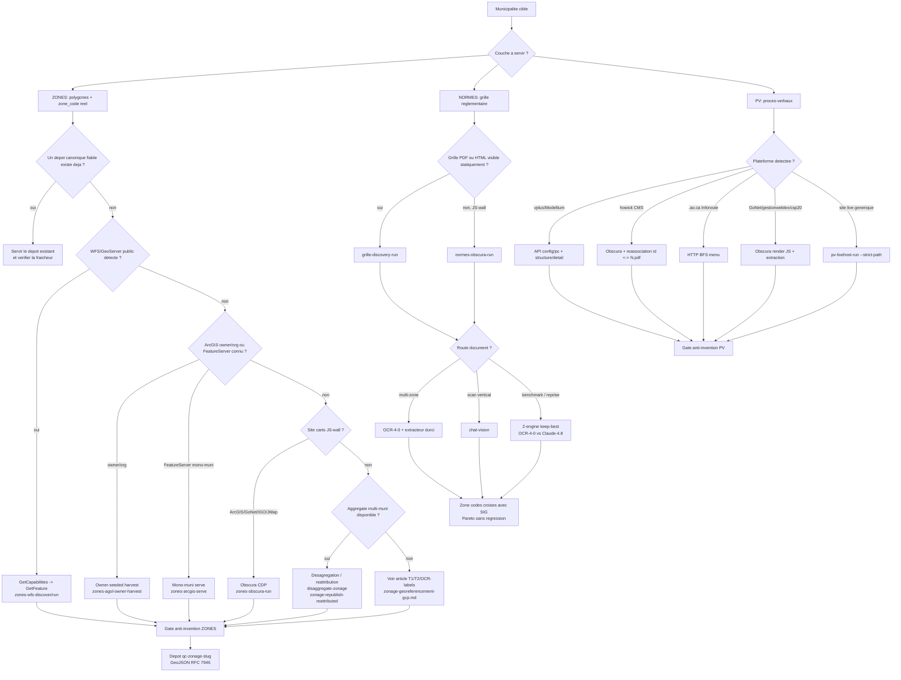
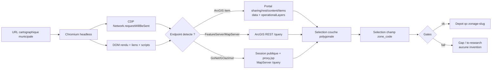
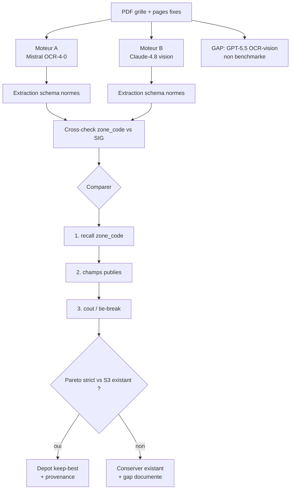
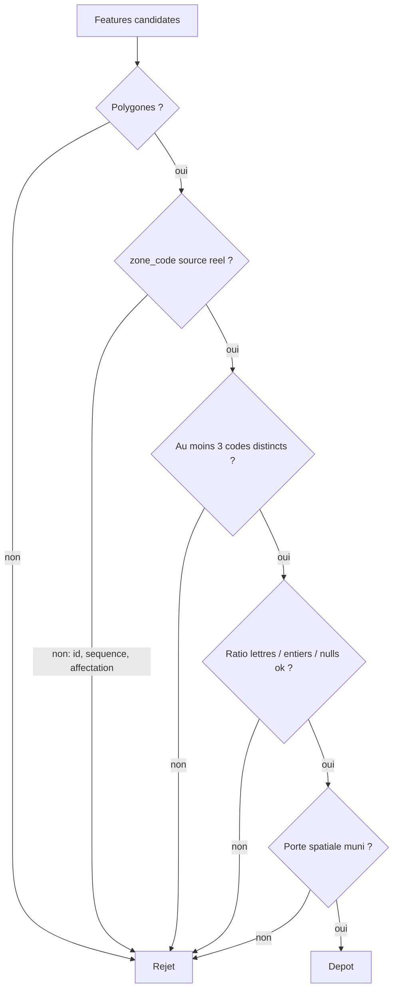

# Methodes d'acquisition des donnees geo-immo

Statut: reference d'ingenierie pour les methodes TypeScript du depot.
Portee: `ZONES`, `NORMES` et `PV` pour les municipalites du Quebec, avec les garde-fous anti-invention.

Ce document capitalise les methodes d'acquisition implementees dans `acquisition/src/` et les rapports d'execution sous
`work/delegation-mass/`. Il ne remplace pas les specifications existantes: il les relie pour decider quelle methode utiliser
sur une municipalite donnee, comment verifier que la donnee est reelle, et comment comparer les moteurs.

## Contrat de preuve

Une methode est documentee ici seulement si elle a un artefact verifiable:

- un code TypeScript dans `acquisition/src/` ou `packages/qc-sources/src/`;
- un rapport interne sous `work/delegation-mass/` ou `work/immo-audit/`;
- un commit du depot quand le fichier est suivi par Git;
- ou un standard public stable.

Les rapports `work/delegation-mass/*` sont cites par chemin parce qu'ils sont les journaux operationnels presents dans ce
checkout. Les chiffres ci-dessous proviennent de ces rapports; quand un detail n'est pas verifiable, il est marque comme
gap au lieu d'etre extrapole.

## Standards publics utilises

| Standard ou API publique | Utilisation dans le depot |
| --- | --- |
| OGC Web Feature Service 2.0.0 (`GetCapabilities`, `GetFeature`) | Extraction WFS/GeoServer par `zones-wfs-discover.ts` et `zones-wfs-run.ts`. |
| Esri ArcGIS REST Services (`FeatureServer`, `MapServer`, `/query`) | Extraction ArcGIS directe, owner-seeded harvest et proxy GoNet/GOazimut. |
| Esri ArcGIS Portal Sharing REST (`sharing/rest/content/items`) | Resolution des items, `data`, `operationalLayers`, services d'organisation. |
| Chrome DevTools Protocol (`Network`, `Page`, `Runtime`) | Capture des appels backend depuis Chromium headless dans les methodes `obscura`. |
| Google reCAPTCHA v3 | Contrainte operationnelle GoNet/GOazimut: score invisible, IP datacenter/k8s bloquee dans les runs observes. |
| ISO 32000 PDF / GeoPDF | Support des GeoPDF de zonage dans l'article dedie de georeferencement. |
| RFC 7946 GeoJSON | Format de sortie vectoriel attendu pour les `qc-zonage-*`. |
| RFC 9110 HTTP (`HEAD`, `GET`, types media) | Verification live des PDF de proces-verbaux. |

## References internes de base

| Artefact | Role | Commit verifie |
| --- | --- | --- |
| `docs/spec/zonage-georeferencement-gcp.md` | Reference T1 GeoPDF+cadastre, T2 3-GCP et OCR-labels valides. A referencer, ne pas dupliquer. | `f5233cf` |
| `docs/spec/contrat-jointure-immo-zones-lots.md` | Contrat `LOT -> ZONE -> NORMES`, null quand aucune grille fiable. | `c814793` |
| `docs/spec/cadre-acquisition-on-demand.md` | Architecture d'acquisition a la demande, provenance et snapshot. | `d1df0fd` |
| `work/immo-audit/INVENTAIRE-scraping-qc.md` | Inventaire historique du scraping QC et limites des recherches keyword. | `23a0f78` |
| `work/immo-audit/gisement-mrc.md` | Gisement MRC: recherche par collections bruyante, besoin de confirmation spatiale. | `8d4da10` |
| `work/immo-audit/zonage-resolution.md` | Resolution des villes immo et cas d'homonymie. | `6085133` |

## Decision de methode par municipalite

## Regle anti-invention commune

L'acquisition ne doit pas fabriquer une donnee reglementaire. Les methodes ci-dessous appliquent la meme discipline:

- `zone_code` doit venir d'une source publiee, pas d'un compteur sequentiel, d'un identifiant technique ni d'une etiquette
  d'affectation vague;
- une collection de zones doit contenir au moins 3 codes distincts avant depot;
- la geometrie doit passer une porte spatiale vers la municipalite cible;
- les champs trop numeriques ou trop vides sont rejetes dans les extracteurs ArcGIS;
- pour les normes, les codes lus dans la grille sont croises avec les codes SIG disponibles;
- pour les PV, un lien doit etre un vrai PDF live et un vrai proces-verbal de seance, pas un budget, un ordre du jour,
  un reglement ou une page d'avis.

Les contrats de jointure et d'acquisition a la demande confirment que l'absence de donnee fiable reste `null` ou
`to-research`: on ne complete pas par analogie.

## ZONES

Objectif: produire un `qc-zonage-<slug>` vectoriel avec polygones et `zone_code` reglementaire reel. Le detail T1/T2 par
GeoPDF, cadastre et GCP reste dans `docs/spec/zonage-georeferencement-gcp.md`; la presente section couvre les methodes
source en ligne et les gates transverses.

### Z1. Obscura CDP: Chromium headless sur plateformes cartographiques

| Champ | Detail |
| --- | --- |
| Principe | Piloter Chromium headless et capturer le DOM plus les appels backend via Chrome DevTools Protocol. Les appels utiles sont ensuite rejoues ou interroges en HTTP structure. |
| Outils | `acquisition/src/zones-obscura-run.ts`, `acquisition/src/zones-platform-probe.ts`. Derniers commits sources: `f92bb5a` pour le plancher de session GoNet, `4b9ed5e` pour le probe WFS/plateforme. |
| Backend vise | ArcGIS `FeatureServer`/`MapServer` `/query`, ArcGIS Portal item data, GoNet/GOazimut `MapServer` via proxy applicatif. |
| Quand l'utiliser | Quand la carte publique est JS-wall et que le WFS/ArcGIS direct n'est pas evident depuis une recherche statique. |
| Gate anti-invention | Couche polygonale, champ code detecte avec taux non-null suffisant, codes reglementaires reels, porte spatiale vers la municipalite et depot sans clobber aveugle. |
| References | `work/delegation-mass/ZONES-GONET.md`, `ZONES-GONET-SWEEP.md`, `ZONES-RESIDUAL.md`, `ZONES-RESIDUAL2.md`. |

Flux CDP:

Contrainte operationnelle GoNet/GOazimut: les rapports et le code indiquent un blocage des IP datacenter/k8s par
reCAPTCHA v3 invisible. Les runs fiables a l'echelle passent par une sortie residentielle autorisee. Le document ne doit
pas contenir de cookies, jetons ou valeurs sensibles de proxy.

Faits mesures:

- `work/delegation-mass/ZONES-GONET.md`: 3 depots testes, dont `saint-pie-de-guire`, `lac-brome` et
  `saint-francois-du-lac`; pattern de proxy `container/resource-proxy/proxy.jsp` confirme.
- `work/delegation-mass/ZONES-GONET-SWEEP.md`: 29 seeds, 16 depots, 13 vrais negatifs; correction group-layer pour
  `saint-felicien`.
- `work/delegation-mass/ZONES-RESIDUAL.md`: +69 depots GoNet cibles, S3 verifie, codes non-null et porte spatiale.
- `work/delegation-mass/ZONES-RESIDUAL2.md`: +8 depots additionnels; le plancher de navigation GoNet a ete porte a 40s
  pour eviter les faux echecs de session.

### Z2. WFS / GeoServer: `GetCapabilities` puis `GetFeature`

| Champ | Detail |
| --- | --- |
| Principe | Utiliser l'API OGC WFS exposee par GeoServer: decouvrir les couches avec `GetCapabilities`, puis extraire en GeoJSON par `GetFeature`. |
| Outils | `acquisition/src/zones-wfs-discover.ts`, `acquisition/src/zones-wfs-run.ts`; source suivie par `4b9ed5e`. |
| Exemple verifie | GeoServer Geocentralis: `evb:zonage_municipal` et `evb:siadmin_pzon_99_s`. La couche `evb:siadmin_pzon_99_s` contient 224 municipalites selon `work/delegation-mass/ZONES-WFS-DISCOVER.md`. |
| Quand l'utiliser | Quand un endpoint WFS public fournit un identifiant municipal et un champ d'etiquette de zone. |
| Gate anti-invention | `zone_code` non-null sur au moins la moitie des features, porte spatiale, pas de depot si les codes ne sont pas reglementaires. |
| References | `work/delegation-mass/ZONES-PORTAIL-FAMILLE.md`, `work/delegation-mass/ZONES-WFS-DISCOVER.md`. |

Faits mesures:

- `work/delegation-mass/ZONES-PORTAIL-FAMILLE.md`: `evb:zonage_municipal`, 67 villes, 6745 zones, codes reels et
  gate spatial.
- `work/delegation-mass/ZONES-WFS-DISCOVER.md`: le balayage large a trouve peu de nouvelles familles WFS ouvertes; le
  gain reel vient du catalogue Geocentralis plus profond, notamment `evb:siadmin_pzon_99_s`, avec +97 depots rapportes.
- Le meme rapport signale `geo.lachute.ca` comme verrouille: ne pas generaliser le succes Geocentralis a tout GeoServer.

### Z3. ArcGIS owner-seeded harvest

| Champ | Detail |
| --- | --- |
| Principe | Enumerer tout le contenu `Feature Service` / `Map Service` d'un owner ou d'une organisation ArcGIS prolifique, puis associer chaque couche a une municipalite par porte spatiale. |
| Outil | `acquisition/src/zones-agol-owner-harvest.ts`; source suivie par `06ac83b`. |
| Pourquoi | Les recherches keyword par ville ou MRC sont bruyantes et steriles; les audits `INVENTAIRE-scraping-qc.md` et `gisement-mrc.md` recommandent l'enumeration par owner/org et la verification spatiale. |
| Quand l'utiliser | Quand un compte ArcGIS publie beaucoup de couches municipales ou regionales, meme si les titres ne contiennent pas le slug exact. |
| Gate anti-invention | Auto-selection de champ par signature de code; rejet des champs techniques, affectations et titres agricoles; `>=3` codes, `>=50%` codes lettres, `<=80%` entiers purs, longueur max 24, null ratio max 0.5, nearest muni cible. |
| References | `acquisition/src/zones-agol-owner-harvest.ts`, `work/immo-audit/gisement-mrc.md`. |

Cette methode corrige le piege documente dans le code comme anti-`#74`: une couche ArcGIS peut exposer des identifiants
ou des entiers propres mais non reglementaires. Le champ retenu doit ressembler a un code de zonage, pas seulement a une
cle stable.

### Z4. ArcGIS mono-muni serve

| Champ | Detail |
| --- | --- |
| Principe | Servir une municipalite a partir d'une couche ArcGIS connue et d'un champ `zone_code` explicite fourni a l'outil. |
| Outil | `acquisition/src/zones-arcgis-serve.ts`; source suivie par `dbfffec`. |
| Quand l'utiliser | Quand l'URL `FeatureServer/N` et le champ de code reglementaire sont deja identifies pour une municipalite unique. |
| Gate anti-invention | Rejet si moins de 3 codes distincts, moins de 50% de codes lettres, plus de 80% d'entiers purs, longueur max depassee, null ratio trop haut ou porte spatiale echouee. |
| Reference | `work/delegation-mass/ZONES-ACQ.md`: `vercheres` servi avec 120 zones reelles depuis le champ `zonage`. |

Cette methode est volontairement plus manuelle que l'owner harvest. Elle est utile pour une victoire ciblee, mais elle ne
doit pas devenir une passerelle pour forcer un champ douteux.

### Z5. Desagregation et reattribution

| Champ | Detail |
| --- | --- |
| Principe | Decouper un agregat multi-municipal par attribut municipal (`mun_nom`, `MuniTopo`, `MUS_NM_MUN`, etc.) et verifier spatialement chaque sous-ensemble. |
| Outils | `acquisition/src/disaggregate-zonage.ts` (`690293b`), `acquisition/src/zonage-republish-reattributed.ts`. |
| Quand l'utiliser | Quand une source regionale contient des polygones de plusieurs municipalites avec un nom municipal exploitable, ou quand une reattribution haute confiance existe. |
| Gate anti-invention | Mapping de nom vers slug municipal, porte spatiale par bbox/centroid ou point registry, geometrie non vide, sortie additive et no-clobber. |
| References | `work/delegation-mass/ZONAGE-SERVING-92.md`, `ZONES-FOCUS30.md`, `ZONES-CANONICAL.md`. |

Les rapports montrent aussi la limite: la desagregation de masse n'a pas ete forcee quand les agregats ou la reattribution
etaient trop risques pour le focus. Le bon comportement est alors `to-research`.

### Z6. T1 GeoPDF+cadastre, T2 3-GCP et OCR-labels valides

Cette famille n'est pas detaillee ici. La reference normative est `docs/spec/zonage-georeferencement-gcp.md` (`f5233cf`).
Elle documente:

- T1: GeoPDF plus cadastre;
- T2: calage par au moins 3 GCP;
- OCR-labels valides;
- equivalence Claude 4.8 / Codex GPT-5.5 pour la generation de code de cet algorithme;
- contrainte de sandbox Codex: `.git` en lecture seule, donc commit par un porteur a `.git` writable.

Point important: cette equivalence ne prouve rien pour l'OCR-vision GPT-5.5. Le gap est explicite dans la section NORMES.

## NORMES

Objectif: transformer une grille reglementaire publiee en table de normes par `zone_code`, sans inventer de valeurs. Le
contrat aval est celui de `docs/spec/contrat-jointure-immo-zones-lots.md`: si une valeur n'est pas publiee ou pas lue
avec confiance, elle reste `null`.

### N1. Obscura JS-wall pour decouverte de grilles

| Champ | Detail |
| --- | --- |
| Principe | Rendre le site dans Chromium, extraire les ancres et appels utiles apres execution JS, puis classer les documents candidats. |
| Outil | `acquisition/src/normes-obscura-run.ts`; source suivie par `95d5660`. |
| Quand l'utiliser | Quand la decouverte statique ne voit aucune grille mais que le site public charge des documents par JS (`gestionweblex`, `csp20`, liens dynamiques). |
| Gate anti-invention | L'outil ne fabrique pas de document: il garde des URLs reelles, classe les PDFs, rejette plans/images/reglements non-grille, puis delegue le depot au batch normes. |
| References | `work/delegation-mass/NORMES-OBSCURA.md`, `NORMES-OBSCURA-SCALE.md`. |

Fait mesure: `work/delegation-mass/NORMES-OBSCURA.md` indique que, sur 8 villes JS-wall, le rendu a trouve 7 candidats
contre 0 en statique; `marston` et `leclercville` ont ete deposes avec 46 et 27 codes.

### N2. Grille discovery statique

| Champ | Detail |
| --- | --- |
| Principe | Crawling HTTP des pages municipales, classification des liens, confirmation PDF par `HEAD`/`GET` ou signature `%PDF`, puis production d'un manifest. |
| Outil | `acquisition/src/grille-discovery-run.ts`. |
| Quand l'utiliser | Quand les liens de grilles sont visibles sans rendu JS ou peuvent etre atteints par navigation statique. |
| Gate anti-invention | Le manifest ne devient depot que si le batch trouve une vraie route, au moins 3 `zone_code` et des valeurs publiees. |
| References | `work/delegation-mass/NORMES-DISCOVERY-FIX.md`, `NORMES-ROUTE-FIX.md`. |

Cette methode sert aussi de pre-filtre pour router `native`, `multizone`, `vision` ou `auto`. `auto` n'est pas une
autorisation d'inventer: c'est un etat d'attente tant que les pages utiles ne sont pas identifiees.

### N3. OCR routing: OCR-4-0, chat-vision et extracteur durci

| Champ | Detail |
| --- | --- |
| Principe | Router les grilles multizones vers Mistral OCR-4-0 (`/v1/ocr`) puis extraire les cellules; router certains scans verticaux vers chat-vision. |
| Outils | `acquisition/src/lib/ocr.ts`, `packages/qc-sources/src/sources/grille-ocr-extractor.ts`, `acquisition/src/zonage-norms-reocr-keepbest.ts`. |
| Cout documente | `lib/ocr.ts` porte un cout par defaut d'environ 0.001 USD/page pour l'OCR Document AI. |
| Quand l'utiliser | Quand le PDF contient une vraie grille mais que le texte natif est insuffisant ou que la mise en page necessite OCR. |
| Gate anti-invention | Chaque cellule doit venir du markdown OCR ou rester `null`; l'extracteur durci applique parse, unite semantique et plausibilite. |
| References | `work/delegation-mass/NORMES-OCR-HARDEN.md`, `NORMES-OCR-DEPLOY.md`. |

Faits mesures:

- `work/delegation-mass/NORMES-OCR-HARDEN.md`: durcissement rapporte avec commit `cea33be`, gains sur la famille MRC
  Portneuf et zero fausse valeur signalee.
- `work/delegation-mass/NORMES-OCR-DEPLOY.md`: backup de 403 objets, 15 ameliorations, overlap agrege 224 -> 1711 et
  valeurs 2347 -> 6703, sans regression rapportee.

### N4. Deux moteurs keep-best pour normes

| Champ | Detail |
| --- | --- |
| Principe | Lancer deux moteurs sur le meme PDF/page range, normaliser les sorties vers le meme schema, comparer recall et champs publies, puis garder le meilleur seulement s'il ne regresse pas l'existant. |
| Outils | `acquisition/src/zonage-norms-2engine-keepbest.ts`, `acquisition/src/lib/grille-claude-cli.ts`, `acquisition/src/zonage-norms-reocr-keepbest.ts`; source suivie par `6d9fef7`. |
| Moteur A | Mistral OCR-4-0 via `/v1/ocr` et extracteur durci. |
| Moteur B | Claude 4.8 vision via `claude -p`, modele local `claude-opus-4-8`, sortie protegee par le meme garde `buildVisionField`. |
| Quand l'utiliser | Quand une grille multizone a fort enjeu doit etre reprise, benchmarkee ou amelioree sans regression. |
| Gate anti-invention | Cross-validation des codes contre le SIG, comparaison Pareto stricte contre S3 existant, `>=3` zones, provenance ecrite dans `work/coverage/normes-provenance.{json,md}`. |
| Reference | `work/delegation-mass/NORMES-2ENGINE.md`. |

Flux keep-best:

Methodologie de comparaison:

1. utiliser le meme PDF source et les memes pages pour tous les moteurs;
2. produire la meme structure `ZoneNorms`;
3. refuser les champs qui ne sont pas verbatim ou normalisables depuis la source;
4. mesurer d'abord le recall des `zone_code`, puis le nombre de champs publies;
5. ne remplacer l'existant que par un strict gain sans regression;
6. ecrire la provenance du moteur gagnant et garder le backup.

Resultat mesure a documenter tel quel: sur une grille multizone de Stratford avec champs publies, le rapport
`work/delegation-mass/NORMES-2ENGINE.md` donne:

| Moteur | Champs publies |
| --- | ---: |
| Claude-4.8 vision | 142 |
| Mistral-OCR-4-0 | 53 |
| Mistral chat-vision medium | 14 |

Donc, pour ce benchmark precis: `Claude-4.8-vision 142 > Mistral-OCR-4-0 53 > mistral chat-vision (medium) 14`.

Gap explicite: GPT-5.5 comme moteur OCR-vision n'a pas ete benchmarke dans le depot. Il faut faire un benchmark
symetrique avant toute affirmation. L'equivalence Claude 4.8 / Codex GPT-5.5 du document GCP vaut pour la generation de
code et l'implementation d'algorithmes, pas pour la lecture OCR de grilles.

## PV

Objectif: collecter des proces-verbaux de seances reelles, sous forme de PDF publics verifiables. Les methodes PV partagent
un gate plus strict que le simple mot-cle: un budget, un ordre du jour, un reglement, un avis public ou un document de
planification n'est pas un PV.

### P1. vplus / Modellium: API publique pure HTTP

| Champ | Detail |
| --- | --- |
| Principe | Intercepter ou appeler l'API publique vplus/Modellium: `config/pc` pour l'arbre de routes, puis `structure/detail/<elementId>` pour les documents. |
| Outil | `acquisition/src/pv-vplus-run.ts`; source suivie par `a2977cd`. |
| Sortie source | Liens PDF publics, notamment S3 `vplus-documents`, presents dans la reponse API. |
| Quand l'utiliser | Quand le site municipal utilise vplus/Modellium et que les documents sont structures par routes. |
| Gate anti-invention | Pas de devinette d'URL; le lien doit etre dans l'API, porter un contexte PV ou une date pure dans une route PV forte, puis passer verification PDF live. |
| References | `work/delegation-mass/PV-DEEP.md`, `work/delegation-mass/PV-RESIDUAL.md`. |

Faits mesures:

- `work/delegation-mass/PV-DEEP.md`: +56 villes, 6431 PV; vplus compte pour 46 villes et 5526 PV dans ce run.
- `work/delegation-mass/PV-RESIDUAL.md`: +17 villes, 1692 PV; vplus queue 4 villes et 469 PV; commit source `a2977cd`.

### P2. howick-CMS: reassociation `?id=N` vers `N.pdf`

| Champ | Detail |
| --- | --- |
| Principe | Rendre la page, lire les ancres titre+date et reassocier l'identifiant CMS `?id=N` au PDF `N.pdf` quand le site expose ce motif. |
| Outil | `acquisition/src/pv-obscura-run.ts`; source suivie par `6ab362e`. |
| Quand l'utiliser | Quand le CMS montre les metadonnees en HTML rendu mais separe l'URL PDF finale. |
| Gate anti-invention | Reassociation fondee sur les ancres reelles et verification PDF, pas sur une enumeration brute de nombres. |
| Reference | `work/delegation-mass/PV-DEEP.md`: Howick rapporte 8 villes et 482 PV. |

### P3. Abitibi-Ouest Inforoute `.ao.ca`: BFS HTTP du menu

| Champ | Detail |
| --- | --- |
| Principe | Parcourir en BFS les menus ColdFusion `/fr/page/index.cfm?PageID=N` des sites `.ao.ca`, puis extraire les PDFs en contexte municipal/conseil/seance/PV. |
| Outil | `acquisition/src/pv-aoca-run.ts`; source suivie par `a2977cd`. |
| Quand l'utiliser | Quand une municipalite est sur la famille Inforoute Abitibi-Ouest et que les menus statiques exposent les documents. |
| Gate anti-invention | Contexte PV obligatoire pour les liens dates; exclusion ordres du jour, reglements, avis, calendriers et documents non PV. |
| Reference | `work/delegation-mass/PV-RESIDUAL.md`: `.ao.ca` rapporte 13 villes et 1223 PV. |

### P4. Obscura PV: GoNet, GestionWebLex, csp20 et sites JS-wall

| Champ | Detail |
| --- | --- |
| Principe | Rendre les sites JS-wall avec Chromium, extraire les ancres DOM reelles et appliquer le parseur PV partage. |
| Outils | `acquisition/src/pv-obscura-run.ts`, `acquisition/src/pv-gonet-run.ts`. |
| Quand l'utiliser | Quand le site charge les listes de documents apres execution JS ou via une plateforme connue. |
| Gate anti-invention | Meme parseur que les crawlers HTTP: PV token ou date pure seulement dans un contexte PV fort; OJ et documents non PV exclus. |
| References | `work/delegation-mass/PV-OBSCURA-BUILD.md`, `PV-DEEP.md`, `PV-OBSCURA-PROBE.md`. |

Fait mesure: `work/delegation-mass/PV-OBSCURA-BUILD.md` rapporte 5 villes GestionWebLex et 490 PV; des exemples
`st-gilles` sont verifies par `HEAD` en `200 application/pdf`.

### P5. Livehost generique avec `--strict-path`

| Champ | Detail |
| --- | --- |
| Principe | Crawler HTTP avec redirects et fallback sitemap, mais limiter strictement le chemin fourni quand le host est partage. |
| Outil | `acquisition/src/pv-livehost-run.ts`; source suivie par `96dac90`. |
| Quand l'utiliser | Quand aucun connecteur specialise ne couvre le site mais que les PDFs sont publiquement accessibles. |
| Gate anti-invention | `isPureDatePv` accepte seulement une date pure dans un contexte PV; `HEAD`/`GET` doit confirmer un PDF live; `--strict-path` evite la contamination de sites voisins. |
| References | `work/delegation-mass/PV-NEWSTOCK.md`, `PV-NEWSTOCK2.md`. |

Cas documente: `work/delegation-mass/PV-NEWSTOCK2.md` explique qu'un crawl massif sans `--strict-path` a attribue les
memes 110 PV a des municipalites voisines sur un host partage. Ces faux positifs ont ete interceptes et supprimes. Le
gate `--strict-path` est donc obligatoire sur hosts partages.

## Gates specialises

### Gate ZONES

Les seuils exacts dependent de l'outil, mais les extracteurs ArcGIS appliquent explicitement `>=3` codes distincts,
`>=50%` codes lettres, `<=80%` entiers purs, longueur maximale et ratio de nulls.

### Gate NORMES

- Le document source doit etre une vraie grille ou un segment de reglement contenant une grille.
- Les `zone_code` lus doivent se recouper avec les codes SIG quand une couche SIG existe.
- Une cellule non lue ou ambigue reste `null`.
- Le keep-best ne depose que si le resultat ne regresse pas l'existant.

### Gate PV

- `isPureDatePv` ne suffit que dans un contexte PV fort.
- Les ordres du jour, budgets, by-laws/reglements, avis, calendriers, rapports et documents de taxation sont exclus.
- Un echantillon doit repondre en live `200` avec type `application/pdf` ou signature PDF.
- Sur host partage, `--strict-path` est obligatoire.

## Methodologie bi-moteur et limites

Deux usages de moteurs doivent rester separes:

| Usage | Etat verifie |
| --- | --- |
| Generation de code pour T1/T2/OCR-labels | `docs/spec/zonage-georeferencement-gcp.md` conclut une equivalence pratique Claude 4.8 / Codex GPT-5.5 sur des parties complementaires de l'algorithme. |
| OCR-vision de grilles de normes | Benchmarks internes disponibles pour Claude-4.8 vision, Mistral-OCR-4-0 et Mistral chat-vision medium seulement. |

Consequences:

- alterner Claude et Codex est valide pour absorber les limites de quota de generation de code, comme documente par
  l'article GCP;
- un agent Codex en sandbox `.git` read-only peut produire le patch mais doit faire committer par un porteur dont `.git`
  est writable;
- aucune conclusion GPT-5.5 OCR-vision ne doit etre tiree avant un benchmark symetrique.

## Resilience operationnelle

Les runs longs ne doivent pas dependre d'une session interactive unique.

- Les rapports `PV-NEWSTOCK2.md` et `NORMES-2ENGINE.md` documentent des lanes `nohup` detachees qui survivent au crash du
  processus conducteur.
- Les depots S3 ou manifests sont la verite operationnelle pendant les sweeps; `coverage-matrix.json` n'est pas modifie
  par les lanes tant que le conducteur n'a pas reconcilie.
- Les outils `acquisition/src/coverage-reconcile.ts`, `coverage-matrix.ts` et `coverage-report.ts` servent a reconstruire
  la matrice depuis les artefacts de depot et les manifests.
- Les registres de provenance, notamment `work/coverage/normes-provenance.{json,md}`, doivent etre ecrits au fil de l'eau
  pour qu'un crash ne perde pas le contexte de comparaison.

## Synthese par methode

| Couche | Methode | Entree TS | Standard/API | Gate principal | Artefacts |
| --- | --- | --- | --- | --- | --- |
| ZONES | Obscura CDP ArcGIS/GoNet | `zones-obscura-run.ts` | CDP, ArcGIS REST, reCAPTCHA v3 | code reel + spatial | `ZONES-GONET*.md`, `ZONES-RESIDUAL*.md` |
| ZONES | WFS/GeoServer | `zones-wfs-discover.ts`, `zones-wfs-run.ts` | OGC WFS 2.0 | code non-null + spatial | `ZONES-PORTAIL-FAMILLE.md`, `ZONES-WFS-DISCOVER.md` |
| ZONES | ArcGIS owner-seeded | `zones-agol-owner-harvest.ts` | ArcGIS Portal + REST | anti-#74 + spatial | `gisement-mrc.md`, source `06ac83b` |
| ZONES | ArcGIS mono-muni serve | `zones-arcgis-serve.ts` | ArcGIS REST | champ explicite + ratios | `ZONES-ACQ.md`, source `dbfffec` |
| ZONES | Desagregation | `disaggregate-zonage.ts` | GeoJSON interne | nom muni + spatial | `ZONAGE-SERVING-92.md`, source `690293b` |
| ZONES | T1/T2/OCR-labels | Voir article dedie | ISO 32000 / GeoPDF | cadastre/GCP/labels valides | `zonage-georeferencement-gcp.md` |
| NORMES | Obscura grille discovery | `normes-obscura-run.ts` | CDP + HTTP | document reel classe | `NORMES-OBSCURA.md` |
| NORMES | Discovery statique | `grille-discovery-run.ts` | HTTP | PDF confirme | `NORMES-DISCOVERY-FIX.md` |
| NORMES | OCR routing | `lib/ocr.ts`, `grille-ocr-extractor.ts` | Mistral `/v1/ocr` | cellule verbatim ou null | `NORMES-OCR-*.md` |
| NORMES | 2-engine keep-best | `zonage-norms-2engine-keepbest.ts` | OCR-4-0 + Claude CLI | Pareto sans regression | `NORMES-2ENGINE.md` |
| PV | vplus/Modellium | `pv-vplus-run.ts` | API publique vplus | lien API + PDF live | `PV-DEEP.md`, `PV-RESIDUAL.md` |
| PV | howick CMS | `pv-obscura-run.ts` | DOM rendu + HTTP | id reel + PDF live | `PV-DEEP.md` |
| PV | `.ao.ca` Inforoute | `pv-aoca-run.ts` | HTTP BFS | contexte PV | `PV-RESIDUAL.md` |
| PV | Obscura JS PV | `pv-obscura-run.ts`, `pv-gonet-run.ts` | CDP + DOM | parseur PV partage | `PV-OBSCURA-BUILD.md` |
| PV | Livehost strict | `pv-livehost-run.ts` | HTTP RFC 9110 | `--strict-path` + PDF live | `PV-NEWSTOCK*.md` |

## Gaps ouverts

- GPT-5.5 OCR-vision: non benchmarke. Faire un benchmark symetrique sur les memes PDFs/pages que Claude-4.8,
  Mistral-OCR-4-0 et Mistral chat-vision avant toute utilisation comme moteur de lecture de grilles.
- GeoServer hors Geocentralis: les rapports montrent peu de nouveaux endpoints ouverts; ne pas promettre une couverture
  WFS generale sans `GetCapabilities` public et couche exploitable.
- Sources PDF-only de petites municipalites: l'audit MRC indique qu'une part du gisement reste hors vecteur en ligne;
  utiliser l'article T1/T2/OCR-labels plutot que forcer une source web.
