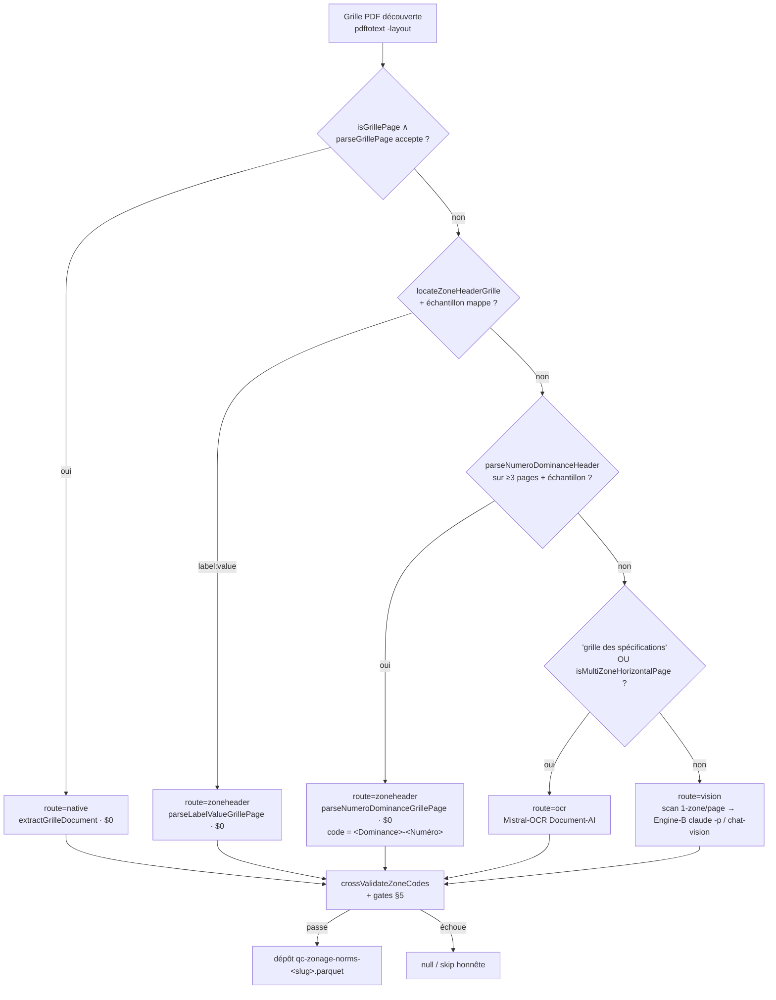

# Méthodes d'extraction du zonage & des normes — arbre de décision PAR CAS

_Statut : référence d'ingénierie. Branche `feat/cadre-acquisition`, HEAD `b926314`.
Date 2026-07-04._

Ce document trace, **cas par cas**, comment une grille réglementaire (NORMES) ou un
plan (ZONES) est **détecté**, **routé**, **parsé** et **contrôlé**. Il est le pendant
« méthodes » de deux documents :

- l'éval **par modèle** (correctness × conso × coût) vit dans
  [`../study/model-eval-vision-ocr.md`](../study/model-eval-vision-ocr.md) — **5 moteurs
  benchés** (Claude 4.8 · GPT-5.5 · GPT-5.4 · Mistral OCR-nu/schéma/Pixtral · Gemini `agy`) ;
- la vue **par source d'acquisition** (WFS/ArcGIS/obscura/PV) et les gates génériques
  vivent dans [`methodes-acquisition.md`](./methodes-acquisition.md) — non dupliqués ici.

Références normatives voisines : l'algorithme de recalage T1/T2 dans
[`zonage-georeferencement-gcp.md`](./zonage-georeferencement-gcp.md), le design des
normes dans [`normes-extraction-retenu.md`](./normes-extraction-retenu.md), le contrat
aval dans [`contrat-jointure-immo-zones-lots.md`](./contrat-jointure-immo-zones-lots.md).

## Contrat de preuve

Une méthode n'est décrite ici que si elle a un artefact vérifiable : une fonction
TypeScript nommée (chemin cité), un commit du dépôt, ou un rapport de run interne. La
discipline transverse est **verbatim-ou-null** : aucune valeur de norme ni aucun
`zone_code` n'est fabriqué ; en cas de doute la donnée reste `null` (normes) ou la
collection n'est pas déposée (zones). Les gates qui garantissent cette propriété sont
consolidés au [§5](#5-gates-transverses-anti-invention).

---

## 1. NORMES — le routeur

Le runner par municipalité est `acquisition/src/zonage-norms-run.ts`. Il prend une
grille PDF **déjà découverte** et **route sur sa projection `pdftotext -layout`** via
`decideRoute` (`zonage-norms-run.ts:416`). L'ordre de décision est **le plus spécifique
d'abord** : chaque famille native ($0, sans LLM) est tentée avant les routes payantes
OCR/vision. Le problème dominant n'est pas le modèle mais la **localisation de la
page-grille** dans un règlement codifié de plusieurs centaines de pages (`--auto-grid-page`,
[§3](#3-localisation-de-la-page-grille)).

Les routes `native`/`zoneheader` invoquent en réalité **une famille de parsers
déterministes** (tous dans `packages/qc-sources/src/sources/grille-ocr-extractor.ts`,
sauf mention). Le tableau §2 dresse la correspondance **grille-type → détection →
parser → tag de provenance**.

## 2. NORMES — table grille-type → détection → parser → gate

| # | Grille-type (exemples) | Layer texte ? | Détecteur | Parser | `methode` (provenance) | Coût |
|---|---|:--:|---|---|---|:--:|
| N-a | Horizontal natif « grille des spécifications » (Sherbrooke) | oui | `isGrillePage` ∧ `parseGrillePage` (`grille-specifications-parser.ts`) | `extractGrilleDocument` (`reglements-zonage-sherbrooke.ts`) | `native-text/header-anchored-cluster` | $0 |
| N-b | 1-zone/page « label : value » (durham-sud, lachute, blainville) | oui | `locateZoneHeaderGrille` (`grille-zoneheader-locator.ts`) + échantillon mappé | `parseLabelValueGrillePage` (`grille-zoneheader-parser.ts`) | `zoneheader` | $0 |
| N-c | 1-zone/page en-tête SÉPARÉ « Numéro de zone: » / « Dominance: » (Béloeil, Saint-Félicien) | oui | `parseNumeroDominanceHeader` sur ≥3 pages + échantillon | `parseNumeroDominanceGrillePage` (code `<Dominance>-<Numéro>`) | `zoneheader` | $0 |
| N-d | 1-zone/page « ZONE: `<code>` » + matrice « NORMES PRESCRITES » numérotée (Nicolet) | oui | `parseZoneHeader` ∧ `isNumberedGrilleSpec` | `parseNumberedGrilleNativePage` (colonne de gauche) | `native-text` (numéroté) | $0 |
| N-e | Transposé « Numéro de zone » / « Usage dominant » en lignes (MRC La Matapédia) | oui | `looksLikeTransposedGrille` | `parseTransposedGrilleNativePage` | `native-text/grille-transposee` | $0 |
| N-f | Transposé zones-EN-COLONNES + normes-en-bas (Sept-Îles, Saint-Tite, Valcourt, Antoine-Labelle) | oui | `looksLikeTransposedColumnsGrille` (via `columnsHeaderZones` ≥3 codes) | `parseTransposedColumnsGrille` | `native-text/grille-transposee-colonnes` | $0 |
| N-g | Bannière « Norme générale » sans tiret « 5A / 2PI / 17P » (Kamouraska, BSL) | oui | `looksLikeNormeGeneraleGrille` (`parseZoneBannerCode` ∧ colonnes générale/particulières) | `parseNormeGeneraleGrillePage` | `native-text` (norme-générale) | $0 |
| N-h | Multizone dense zones-en-colonnes SANS layer natif exploitable (MRC Portneuf / Estrie / Compton) | non/partiel | `specPages` (« grille des spécifications ») OU `isMultiZoneHorizontalPage` (`grille-pdf-classifier.ts`) | Mistral-OCR → `findGrilleTables` → `mapOcrResultToZones` | `ocr/mistral-ocr` | ~$0,001/p |
| N-i | Scan-image / fiche verticale 1-zone/page (saint-stanislas) | non | aucun ancrage natif (fallback du routeur) | Engine-B `claude -p` vision (`lib/grille-claude-cli.ts`) OU chat-vision 2-passes | `claude-cli/opus-4-8` | $0 réel¹ |

¹ Engine-B tourne sur l'**abonnement OAuth** (`apiKeySource:none`) : coût API-équivalent
« fantôme », facturation réelle 0 $, borné par la fenêtre 5 h — voir
[`../study/model-eval-vision-ocr.md`](../study/model-eval-vision-ocr.md).

### 2.1 Les cas natifs $0 — pourquoi chacun existe

Chaque parser natif cible **une signature de mise en page** qu'un OCR générique
lit mal. Tous partagent la même clause anti-invention : **pas d'ancre littérale → `[]`
(aucune zone)**, jamais une zone fabriquée.

- **N-a horizontal (Sherbrooke).** Une page-grille passe l'ancre d'en-tête `isGrillePage`
  ET des lignes acceptées par `parseGrillePage`. C'est le chemin le moins cher et la
  vérité-terrain de référence (hors-OCR).
- **N-b label:value (durham-sud/lachute/blainville).** Chaque page décrit UNE zone avec
  des lignes de normes auto-étiquetées. Le routeur exige un **discriminateur robuste** :
  il lance réellement `parseLabelValueGrillePage` sur un **échantillon étalé** de la
  fenêtre (`sampleAcross`, `zonage-norms-run.ts:453`) et ne route ici que si ≥ la moitié
  des pages publient de vraies normes — auto-cohérent, jamais une heuristique fragile.
- **N-c Numéro/Dominance (Béloeil/Saint-Félicien).** Le code de zone est **scindé** entre
  une ligne « Numéro de zone: `<N>` » et une ligne « Dominance: `<X>` » → recomposé en
  `<Dominance>-<Numéro>` (`parseNumeroDominanceHeader`, l.1653). `readZoneHeaderCode`
  exclut la bannière « Numéro de zone: », donc N-b les manque : sans N-c ils tombaient sur
  l'OCR (titre « grille des spécifications ») et explosaient le plafond de pages. Béloeil
  imprime le numéro **une ligne au-dessus** du label, à droite — géré explicitement.
- **N-d Nicolet numéroté.** Toute la page documente UNE zone (« ZONE: `<code>` », haut-droit)
  et la matrice est un jeu de **lignes numérotées** (1..60) groupées par section
  (USAGES · NORMES PRESCRITES · STRUCTURE · TERRAIN · MARGES · BÂTIMENT · RAPPORTS). On
  publie la **colonne de valeurs la plus à gauche** (même convention que l'extracteur
  vision gelé). Piège OCR corrigé : mistral-ocr lit un « I » sérif comme « 1 » (`I01-132`
  → `101-132`) ; le runner **repique le code verbatim depuis le layer natif** et le passe
  via `OcrMapOptions.zoneCode` — toujours le code de la grille, mais depuis la source fiable.
- **N-e transposé lignes.** Un bloc « Numéro de zone … » ancre les colonnes ; la ligne
  « Usage dominant … » doit se trouver **≤3 lignes en dessous** sinon le bloc est refusé.
  Appariement numéro↔usage par colonne (bord gauche, plus proche ancre, tolérance
  `anchorColTolerance` bornée [3,8]).
- **N-f transposé colonnes.** Zones alignées en **colonnes** dans une bande d'en-tête ;
  `columnsHeaderZones` exige **≥3 codes DISTINCTS à signature lettrée** (une ligne de
  renvoi qui répète « N-2 N-2 N-2 » n'est PAS un en-tête — anti-fragmentation, cf.
  baie-comeau « Riveraine »). Gère un en-tête étalé sur deux lignes (Saint-Tite) et des
  valeurs à deux étages (Valcourt).
- **N-g Norme-générale (Kamouraska/BSL).** Bannière « Zone `<code>` » avec **≥1 chiffre ET
  ≥1 lettre, sans tiret** (`5A`, `2PI`, `17P`) — le code de la page est le **plus fréquent**
  (il apparaît en tête ET en pied ; une référence à une autre zone n'apparaît qu'une fois).
  Le sous-en-tête à deux colonnes « Norme générale » / « Normes particulières » borne la
  bande de valeurs ; on lit la **cellule de la colonne générale** (`ngGeneraleCell`), jamais
  la note « particulière » plus à droite. Les dimensions bâtiment ne mappent QUE sous une
  section terrain/lotissement (anti-sur-mapping : un mauvais repli vaut moins qu'un `null`).

### 2.2 Le chemin OCR (N-h) et son garde structurel

Le chemin OCR passe la fenêtre de pages à Mistral-OCR (`/v1/ocr`, `mistral-ocr-4-0`),
puis `findGrilleTables` (l.539) parcourt le markdown, localise la **première ligne
d'en-tête de zones** (forme numérique-préfixée d'abord — « Zones Ra » + « 101 102 … » →
`Ra-101` — puis alpha standard), et découpe le bloc en **bandes de zones** successives.
Un en-tête absent dans la table peut être **ancré sur la ligne de texte juste au-dessus**
(`asTextLineZoneHeader`). `mapOcrResultToZones` produit les `ZoneNorms` sous le même garde
`buildVisionField`. **Limite structurelle** documentée dans le code
(`zonage-norms-run.ts:439-442`) : sur un transposé, la linéarisation markdown perd
l'association **colonne-zone ↔ valeur** — l'OCR lit alors la classe d'USAGES (`H1/C1/I3…`)
comme codes de zone → overlap=0. C'est pourquoi N-e/N-f (natifs) passent **avant** N-h.

## 3. Localisation de la page-grille — `--auto-grid-page`

Un règlement de zonage **codifié** enterre son annexe « grille des usages et normes »
profondément (dudswell : p.223–228 sur 287). Le plafond OCR par défaut (~80 pages)
tranche alors l'annexe → 0 zone extraite. `--auto-grid-page` (ADDITIF, off par défaut)
pré-scanne le texte page-par-page (`detectGridPages`, `zonage-norms-run.ts:314`) :

- une page est page-grille quand **≥6 tokens de code-zone DISTINCTS** (`AUTO_GRID_MIN_CODES`)
  tiennent sur **UNE seule ligne** (bande d'en-tête zones-en-colonnes) ;
- token = `\b[A-Z]{1,4}-?\d{1,3}\b` ; on écarte d'abord les lignes de référence règlement/
  article et celles portant une année (`GRID_HEADER_EXCLUDE`), et les pages
  table-des-matières (`looksLikeTableOfContents`, `lib/zonage-norms.ts:594`) ;
- on renvoie la fenêtre `[min−2, max+2]` (`AUTO_GRID_MARGIN`).

Sans le garde ToC, une table des matières (dense en refs d'articles + numéros de page)
se fait prendre pour la bande d'en-tête (carignan 483-39-U : ToC en p.12 → OCR du corps
d'articles → 125 codes bidons, 0 % de champs). Le garde `shouldRejectForZeroNormFields`
([§5](#5-gates-transverses-anti-invention)) est le filet final sur ce cas.

## 4. ZONES — méthodes par cas

Objectif : servir `qc-zonage-<slug>` (GeoJSON de polygones + `zone_code` réglementaire
RÉEL). Les sources en-ligne (WFS/ArcGIS/obscura, désagrégation MRC) sont détaillées dans
[`methodes-acquisition.md`](./methodes-acquisition.md) et l'algorithme de recalage PDF
dans [`zonage-georeferencement-gcp.md`](./zonage-georeferencement-gcp.md). Ne sont
tracés ici que les cas d'extraction/lecture non couverts ailleurs et la distinction
**affectation ≠ zonage**.

| Cas ZONES | Détection / condition | Outil | Garde spécifique |
|---|---|---|---|
| ArcGIS/AGOL FeatureServer (+ split MRC) | couche polygonale + champ code réel ; agrégat multi-muni | `zones-agol-owner-harvest.ts`, `zones-arcgis-serve.ts`, `disaggregate-zonage.ts` | auto-sélection champ anti-`#74`, split par `mun_nom`/`MuniTopo`, gate spatial |
| Open-data GeoJSON (remplace AFFECTATION) | le SIG servi n'expose qu'une affectation grossière (AGF/AGR/URB…) → normes ne joignent pas | `zonage-opendata-deposit.ts` | `validateExplicitZoneField` (≥3 codes lettrés) + **OVERLAP≠0 avec la grille normes** (rejet sinon) + gate spatial |
| T1 GeoPDF texte-natif ($0) | géoréf embarqué `/VP /Measure /GPTS` + étiquettes `pdftotext -bbox-layout` | `t1-build.ts` (voie texte) | résidu de calage < seuil, gates §2.4 GCP |
| T1 glyph-recalage vision (`--labels`) | codes DESSINÉS en glyphes (0 mot sélectionnable) | `--labels claude` (`lib/t1-labels-claude.ts`) ou `--labels gpt55` (`lib/t2-labels-gpt55.ts`) | `--dict` **obligatoire** ; `validateGpt55LabelReads` : code verbatim + position in-crop, sinon rejet |

**Affectation ≠ zonage.** Une couche d'AFFECTATION (Habitation/Commerciale, 8 catégories
CMM/SAD) n'est **pas** un zonage réglementaire : ses codes ne joignent pas la grille de
normes (`RA-106`). Cas fondateur **repentigny** : le portail ArcGIS n'expose que
l'affectation (et sa `/query` est cassée) → ré-acquisition via le VRAI zonage
(Règlement n°437, champ `NUMEROZONE`, ex. `C4-132`) publié en open-data sur Données
Québec (`zonage-opendata-deposit.ts`). Même logique pour beaupré. L'ancien dépôt
(affectation) est **sauvegardé** sous une clé non-matchée avant remplacement.

**Recalage glyph-vision — deux backends, un garde.** `--labels claude` (Claude 4.8,
l'agent lui-même, commit `decdc42`, huberdeau servi) et `--labels gpt55` (GPT-5.5,
commit `ca2a5aa`) partagent **octet pour octet** le validateur `validateGpt55LabelReads` :
seul le lecteur vision diffère, la garde anti-invention est identique. Seule la **lecture**
du code est modélisée ; le géoréf reste l'embarqué (pas de calage).

## 5. Gates transverses (anti-invention)

Tous les gates NORMES sont dans `acquisition/src/lib/zonage-norms.ts` ; le garde par
cellule dans `packages/qc-sources/src/sources/grille-vision-extractor.ts`.

| Gate | Fonction (chemin:ligne) | Règle |
|---|---|---|
| Verbatim-ou-null par cellule | `buildVisionField` (`grille-vision-extractor.ts:543`) | concordance 2-passes → parse nombre → **type-check sémantique unité** → fenêtre de plausibilité ; sinon `value:null` + flag, `raw` gardé. Publie à `VISION_PUBLISH_CONFIDENCE = 0.92`. |
| ≥3 codes distincts | `MIN_DEPOSIT_ZONE_CODES = 3` (`zonage-norms-run.ts:103`) | pas de dépôt sous 3 `zone_code` uniques réels. |
| Overlap SIG ≠ 0 | `shouldRejectForZeroOverlap` (l.559) | si une grille SIG existe (`gridFound`) mais `overlap===0` → **rejet** (OCR mal routé lisant des labels comme codes — kirkland). |
| fieldPct ≠ 0 | `shouldRejectForZeroNormFields` (l.577) | `publishedFieldPct===0` → **rejet** (codes sans aucune norme = corps d'articles / ToC — carignan). Filet même sans grille SIG. |
| Pont numérique anti-fusion | `overlapWithNumericBridge` / `reconcileZoneNumbers` (l.444-501) | pont extracted↔SIG par identifiant numérique **unique des DEUX côtés** (millésime : `CV-RF-106` ⇄ `RA-106`) ; un numéro porté par ≥2 codes n'est **jamais** ponté (aucun gagnant choisi), deux numéros différents ne sont jamais rapprochés. |
| Canon en lockstep | `canonZone` → `canonicalizeZoneCodeForJoin` (`@sentropic/geo`) | le canon du **gate de dépôt** = celui de la **jointure runtime** lot⋈zone⋈norms : l'overlap mesuré est exactement celui que la jointure réalise (aucun drift), commit `24552e9`. |
| Cross-validation SIG | `crossValidateZoneCodes` (l.515) | recoupe les codes lus avec la grille SIG (recoupExtracted = précision, recoupSig = rappel) ; `crossval-refresh.ts` recalcule l'overlap des dépôts existants sans re-payer d'OCR. |
| Gate spatial (ZONES) | `t1-build.ts` gates §2.4, `zones-*` | centroïde/bbox des étiquettes dans la bonne municipalité (anti-homonymes). |
| Rejet séquentiel/affectation/CMM/OBJECTID | extracteurs ArcGIS (anti-`#74`), `nonAdmissibleCodes` (GCP §7.5) | un `OBJECTID`/`NO_ZONE` séquentiel, une affectation régionale (CMM/PMAD/SAD/agricole) ou un identifiant technique n'est jamais un `zone_code`. |

Le garde `buildVisionField` est **hérité tel quel** par les DEUX moteurs de lecture
(Engine-A Mistral-OCR et Engine-B `claude -p`) : l'invention est structurellement
impossible quel que soit le modèle — cf. `zonage-norms-2engine-keepbest.ts` (comparaison
keep-best, Pareto strict sans régression, provenance écrite au fil de l'eau).

## 6. Références

**Code (chemins vérifiables)**
- Routeur : `acquisition/src/zonage-norms-run.ts` (`decideRoute`, `detectGridPages`,
  `--auto-grid-page`, `MIN_DEPOSIT_ZONE_CODES`).
- Parsers : `packages/qc-sources/src/sources/grille-ocr-extractor.ts`
  (`parseZoneHeader`, `isNumberedGrilleSpec`, `parseNumberedGrilleNativePage`,
  `looksLikeTransposedGrille`/`parseTransposedGrilleNativePage`,
  `looksLikeTransposedColumnsGrille`/`columnsHeaderZones`/`parseTransposedColumnsGrille`,
  `parseNumeroDominanceHeader`/`parseNumeroDominanceGrillePage`,
  `parseZoneBannerCode`/`looksLikeNormeGeneraleGrille`/`parseNormeGeneraleGrillePage`,
  `findGrilleTables`, `mapOcrResultToZones`).
- Moteurs de lecture : `acquisition/src/lib/grille-claude-cli.ts` (Engine-B),
  `acquisition/src/lib/ocr.ts` (Engine-A), `grille-vision-extractor.ts` (`buildVisionField`).
- Gates & jointure : `acquisition/src/lib/zonage-norms.ts`,
  `acquisition/src/zonage-norms-2engine-keepbest.ts`,
  `acquisition/src/zonage-norms-crossval-refresh.ts`.
- ZONES : `acquisition/src/t1-build.ts` (`--labels`), `lib/t1-labels-claude.ts`,
  `lib/t2-labels-gpt55.ts` (`validateGpt55LabelReads`),
  `acquisition/src/zonage-opendata-deposit.ts`, `disaggregate-zonage.ts`,
  `zones-s3-check.ts`.

**Commits**
- `24552e9` — lockstep canon (gate ⇄ jointure) + pont numérique millésime + refresh manifest.
- `decdc42` — voie labels Claude-4.8 vision pour GeoPDF glyphes (huberdeau servi).
- `b926314` — parser Norme-générale + câblage transposés natifs-d'abord ($0). **(HEAD)**

**Documents liés** : [`../study/model-eval-vision-ocr.md`](../study/model-eval-vision-ocr.md)
(éval par modèle) · [`methodes-acquisition.md`](./methodes-acquisition.md) (sources) ·
[`zonage-georeferencement-gcp.md`](./zonage-georeferencement-gcp.md) (recalage T1/T2) ·
[`normes-extraction-retenu.md`](./normes-extraction-retenu.md) (design normes) ·
[`contrat-jointure-immo-zones-lots.md`](./contrat-jointure-immo-zones-lots.md) (contrat aval).
</content>
</invoke>
