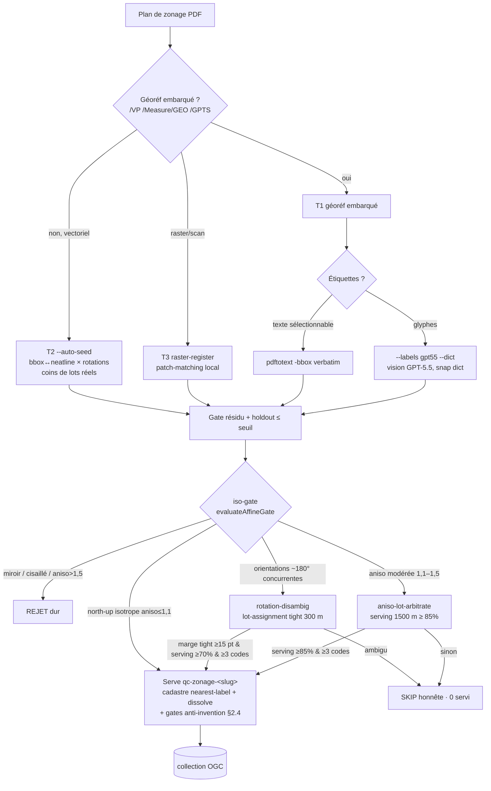

# Géoréférencement du zonage municipal — algorithme T1/T2 et équivalence bi-moteur (Claude 4.8 ⊕ Codex 5.5)

_Statut : capitalisation d'algorithme. Branche `feat/cadre-acquisition`. 2026-06-29,
étendu 2026-07-02 (§6-§10) : industrialisation du recalage PDF→zones autonome
(T2 `--auto-seed`, iso-gate, désambiguïsation rotation, arbitrage anisotropie, `--fit
similarity`, relaxation numérique dict-gatée, multi-feuillets) et son plafond._

Cet article documente (1) **l'algorithme** qui transforme un plan de zonage municipal PDF
en collection vectorielle servable, et (2) le fait — vérifié empiriquement — que **deux
moteurs LLM en effort maximal (Claude Opus 4.8 « xhigh » et Codex GPT-5.5 « xhigh »)
produisent une implémentation équivalente** de cet algorithme, ce qui rend la chaîne
robuste à l'épuisement de quota d'un fournisseur.

---

## 1. Problème & contrat de données

« Servir le zonage » d'une municipalité = exposer une collection OGC
`qc-zonage-<slug>` : **GeoJSON de POLYGONES** portant un champ **`zone_code`
réglementaire RÉEL** (ex. `H-3`, `RA-101`, `C-15`). Le frontend (radar-immobilier)
la consomme en passthrough pour colorier la carte et joindre `signal → zone`. Il faut
donc **de la géométrie vectorielle + un code de zone réel** — un PDF de règlement
OCRisé seul (codes sans polygones) ne suffit pas. Voir
[`contrat-jointure-immo-zones-lots.md`](./contrat-jointure-immo-zones-lots.md).

**Invariant anti-invention** (non négociable) : on ne publie qu'un `zone_code`
verbatim issu d'une source réelle, géométrie issue du cadastre réel, et seulement si
les gates QA passent ; sinon on **flague honnêtement** (0 servi) — jamais un identifiant
séquentiel (`OBJECTID`/`NO_ZONE` numérique) ni un libellé d'affectation régionale.

---

## 2. L'algorithme

La géométrie ne vient **jamais** du PDF : elle vient du **cadastre du Québec**
(parcellaire officiel, 100 % province, déjà possédé). Le PDF ne fournit que les
**étiquettes de code de zone géoréférencées**. C'est l'idée centrale (« cadastre
line-of-sight ») : chaque lot cadastral hérite du code de l'étiquette la plus proche en
ligne de vue, puis on dissout les lots par `zone_code`.

### 2.1 T1 — GeoPDF à géoréférencement embarqué

1. **Détection du géoréf embarqué** : un Geospatial PDF (ISO 32000 / « GeoPDF »)
   porte la transformation page→projeté dans les dictionnaires `/VP` (Viewport),
   `/Measure`, `/GPTS` (geo points), `/GCS`/`/PRJ` (système de coordonnées),
   `/Bounds`, `/LGIDict`. **Piège mesuré** : les mesures d'échelle CAD
   `/Subtype/RL` (ratio papier/terrain) **ne sont PAS** un géoréf — un détecteur naïf
   les compte comme tel (faux positif : seuls 4/13 plans focus avaient un vrai ancrage).
2. **Transformation page→WGS84** : affine dérivée des `/GPTS`+`/Bounds`, reprojetée via
   `proj4` (NAD83/MTM ou Lambert selon le PDF). **0 GDAL requis** : la transformation
   est dans le PDF.
3. **Extraction des étiquettes** : texte sélectionnable via `pdftotext -bbox-layout`
   (codes verbatim + position page) → reprojetés en WGS84.
4. **Agrégation cadastre line-of-sight** : chaque lot (`normalized/qc-cadastre-lots/<slug>`)
   prend le code de l'étiquette la plus proche ; dissolve par `zone_code` →
   MultiPolygon par zone, `InteriorPointArea` fidèle GEOS.

### 2.2 T2 — calage 3-GCP manuel (plan SANS géoréf embarqué)

Pour un PDF vectoriel à codes réels mais sans ancrage géo (que des mesures `/RL`) :
un humain (ou un agent) place **≥3 points de contrôle** (point page ↔ point réel) ;
on ajuste une **transformation affine par moindres carrés** (`fitAffine`, partagée avec
T1) ; on rejette si **résidu de calibration > seuil** (défaut 50 m) ou GCP quasi
colinéaires. Le reste de la chaîne = identique à T1 (étapes 3-4). Recette éprouvée
historiquement sur `sainte-catherine` (« calage 3-GCP », ADR-0023).

### 2.3 Étiquettes glyphes — OCR validé par dictionnaire réglementaire

Certains plans ont les codes en **glyphes** (non sélectionnables) → l'OCR positionné
(tesseract) donne la **position** fiable mais **corrompt le code** (`Re3y`, `Rez3`…).
Solution anti-invention : construire le **dictionnaire des codes réglementaires RÉELS**
(depuis les annexes du règlement de zonage, ou la grille de normes), puis **snapper**
chaque étiquette OCR au code valide le plus proche par distance d'édition **seulement
si non-ambigu** ; sinon rejeter l'étiquette. On ne sert que si le taux de snap
non-ambigu dépasse un seuil (ex. 80 %).

### 2.4 Gates QA anti-invention (communs T1/T2/OCR)

`≥3` codes lettrés distincts · rejet des codes séquentiels purs / affectation
(CMM/PMAD/SAD/`milieux_humides`/inondable/agricole) · gate spatial : centroïde des
étiquettes dans la bonne municipalité (gaffe homonymes : `saint-mathieu` vs
`-de-beloeil`, `dorval` vs `lile-dorval`) · géométrie = lots cadastraux réels uniquement.
Voir [`zonage-acquisition-qa-gate`](../../) (mémoire projet).

---

## 3. Implémentation TypeScript (0 Python, 0 GDAL)

| Module | Rôle | Moteur |
|---|---|---|
| `acquisition/src/lib/t1-zones.ts` | agrégation cadastre nearest-label + InteriorPointArea | Claude 4.8 |
| `acquisition/src/lib/t1-georef.ts` | géoréf embarqué (`/GPTS /Measure /VP /GCS`) → affine `proj4` ; `fitAffine` exporté | Claude 4.8 |
| `acquisition/src/lib/t1-labels.ts` | étiquettes `pdftotext -bbox-layout` (+ extraction mono-page) | Claude 4.8 |
| `acquisition/src/t1-build.ts` | CLI T1 bout-en-bout + gates QA | Claude 4.8 |
| `acquisition/src/lib/t2-georef.ts` | calage ≥3 GCP, affine moindres carrés (réutilise `fitAffine`) | Codex 5.5 |
| `acquisition/src/t2-build.ts` | CLI T2 (GCP JSON + PDF + cadastre → serve) | Codex 5.5 |
| `acquisition/src/t2-georef-ui.ts` | UI locale Leaflet : PDF rasterisé + fond carte + capture GCP + preview/serve | Codex 5.5 |
| `acquisition/src/lib/zone-serve.ts` | contrat de serving partagé (`haversineKm`, `mergeByZoneCode`) | Codex 5.5 |
| `acquisition/src/t1-ocr-build.ts` + `lib/t1-labels-ocr.ts` | snap OCR positionné → dictionnaire réglementaire validé | Codex 5.5 |

Le port T1 reproduit **bit-exact** la recette Python legacy de référence
(`work/legacy-geo-quebec/saint-mathieu/build_zones.py`) — voir §5.

---

## 4. Équivalence bi-moteur (Claude 4.8 « xhigh » ⊕ Codex GPT-5.5 « xhigh »)

### 4.1 Production mesurée

**Claude Opus 4.8 (xhigh)** — port déterministe + T1 auto :
- Porté `build_zones.py` → TS (commits `9a3f9c3`, `7f87428`, `7b7307c`).
- **Golden vert** : `saint-mathieu` bit-exact (8447/8447 lots, 55 features, 0 écart sur
  57 codes) ; `saint-amable` 103/104 codes, 104 features, 90,6 % lot→zone (golden 85,7 %).
- Servi (géoréf embarqué) : **delson** (97 zones, 3330/3330 lots, résidu 0,29 m),
  **la-prairie** (263/267 codes/91,5 %/1,17 m), **candiac** (218/229/100 %/0,29 m),
  **saint-mathieu** (35/38/99,9 %/0,30 m).
- Benchmark : **~3,8 s/ville**, ~340 Mo RAM, $0 OCR, 0 GDAL/cloud/humain.
- Découverte structurante : seuls 4/13 plans focus ont un vrai géoréf embarqué (les 9
  autres = `/RL` CAD → relèvent du T2).

**Codex GPT-5.5 (xhigh)** — outil T2 interactif + OCR-validé :
- Construit l'outil **T2 3-GCP** (CLI + UI Leaflet + helpers partagés) + tests **4/4**
  (commit `1b66b72`, après reprise du commit bloqué par un `.git` read-only côté sandbox).
- Servi **saint-philippe** via calage 3-GCP (gates QA passés : résidu < 50 m, ≥3 codes,
  gate spatial).
- Servi **pointe-claire** via OCR validé : dictionnaire = règlement **PC-2775 annexe 3**
  (274 codes réels) ; **253/294** étiquettes snappées sans ambiguïté (86,1 %), 41
  rejetées, 165 codes distincts validés. (A correctement **écarté** une sortie Mistral
  OCR `Re1..Re70` séquentielle suspecte — réflexe anti-invention.)

### 4.2 Verdict de parité

Les deux moteurs ont **livré une implémentation correcte, testée, anti-invention tenue**,
de parties **complémentaires** du même algorithme — Claude le noyau déterministe (port +
golden + T1 auto), Codex la couche interactive (T2 3-GCP + OCR validé). Chacun réutilise
les primitives de l'autre (`fitAffine`, `zone-serve`). **Conclusion opérationnelle :
l'un peut prendre le relais de l'autre** — la chaîne n'est pas captive d'un fournisseur,
ce qui a permis de continuer quand le quota Claude s'est épuisé.

### 4.3 Notes opérationnelles

- **Sandbox Codex** : `.git` en lecture seule → Codex ne peut pas committer/pusher
  lui-même ; le dépôt S3 (writable) réussit, mais **le code doit être committé par un
  porteur à `.git` writable** (ici Claude conducteur). À prévoir dans tout pipeline Codex.
- **Quota** : Claude (souscription) et Codex (GPT) ont des limites indépendantes ;
  alterner les deux évite le throttle/épuisement d'un seul. Effort : « xhigh » des deux côtés.
- **Coût** : T1 auto ≈ $0 OCR ; OCR-validé ≈ $0,001/ville ; T2 = temps humain de calage
  (~5-10 min/ville) ou GCP autonome de l'agent sous gate de résidu.

---

## 5. Résultats & reproductibilité

Au moment de cet article, **focus-30 = 14/30** servies proprement (dont 6 par cette
chaîne : delson/la-prairie/candiac/saint-mathieu en T1, saint-philippe en T2,
pointe-claire en OCR-validé). Endpoints : `https://api.geo.sent-tech.ca/collections/qc-zonage-<slug>/items`.

Reproduire : `npx tsx acquisition/src/t1-build.ts --slug <slug> …` (T1) ;
`npx tsx acquisition/src/t2-build.ts --slug <slug> --gcp <fichier.gcp.json> …` (T2) ;
golden : `npx vitest run acquisition/src/lib/t1-zones.test.ts acquisition/src/lib/t2-georef.test.ts`.

---

## 6. Recalage autonome industrialisé — les voies (session `feat/cadre-acquisition`)

Le §2 pose l'algorithme (géométrie = cadastre, PDF = étiquettes). Ce segment l'a
**industrialisé pour le fonctionnement autonome de l'agent** : plus besoin d'un humain
qui place les GCP à la souris (T2 manuel §2.2). Le pipeline dérive lui-même les points
de contrôle depuis le cadastre réel, sous des **gates de rejet durs** (§7) arbitrés
in fine par la **couverture-lots** (§8). Toutes les voies déposent la même collection
`qc-zonage-<slug>` et passent les gates anti-invention du §2.4.

### 6.1 T1 — géoréf embarqué (+ voie glyph-vision)

- **Voie texte** (inchangée) : `t1-build.ts --slug <slug> --pdf <url|path>`, étiquettes
  `pdftotext -bbox-layout` verbatim ; affine dérivée des `/GPTS`+`/Bounds`.
- **Voie glyph-vision** (`ca2a5aa`) : quand les codes sont **dessinés en glyphes**
  (0 mot sélectionnable), `--labels gpt55 --dict <codes.json>` rastérise la **neatline
  embarquée** (`geo.bbox`, `--ocr-dpi`, ~300 DPI pour les plans glyphes), lit les
  étiquettes **positionnées** avec la vision GPT-5.5 (`acquisition/src/lib/t2-labels-gpt55.ts`),
  et ne conserve QUE les codes qui valident **verbatim + sans ambiguïté** contre le
  dictionnaire réglementaire (`--dict` **obligatoire** sur ce chemin — cf.
  `t1-build.ts:180`). Même garde anti-invention que la voie OCR §2.3, mais le géoréf
  reste celui embarqué (pas de calage), donc seule la **lecture** du code est modélisée.
- **Durcissement gros PDF** (`ca2a5aa`) : `t1-georef.ts` borne l'extraction
  (`DEFAULT_MAX_CHARS` 400 Mo, `DEFAULT_MAX_INFLATE` 64 Mo) pour ne pas exploser sur les
  GeoPDF volumineux. Résidu de coin publié (`AffineFit.maxResidualM`, `geo.scaleMPerPt`,
  échelle typique ~1-10 m/pt) ; sert seulement sous le seuil de résidu.

### 6.2 T2 `--auto-seed` — recalage vectoriel autonome (`7e766f3`)

Pour un plan vectoriel **sans géoréf embarqué** (que des mesures `/RL`), l'agent n'a
plus à placer les GCP. `deriveAutoSeedGcps` (`acquisition/src/lib/t2-autogcp.ts`) :

1. calcule la **bbox WGS84 du cadastre** de la muni et la bbox/neatline de la page ;
2. essaie plusieurs **cadrages** (`full`, `percentile`, `density+20%`) × **rotations**
   (`rot0/90/180/270`) comme *seed grossier* bbox↔neatline ;
3. pour chaque seed, apparie les **coins de lots cadastraux réels** (`extractSvgVectorPoints`
   sur le SVG `pdftocairo`) aux coins de parcelles projetés, dans un rayon de recherche
   (`--max-candidate-m`, défaut 450 m) ;
4. ajuste l'affine et **prune sur résidu + holdout** : ne retient que si `residual_max`
   et l'erreur sur les coins **retenus hors ajustement** passent le seuil
   (`--max-residual-m` ; garde-fou de run éprouvé : **15 m**, `--min-gcps 8`).

Le seed n'est jamais servi tel quel : la validité vient des **coins de lots réels**
qui convergent, pas de la bbox. Les points de contrôle sont des coins de parcelles,
**jamais des coins de bbox**.

### 6.3 T3 — raster-register (recalage image, local)

`acquisition/src/t2-raster-register.ts` (`deriveRasterRegistration`) : dérivation de
GCP par **enregistrement d'image** (patch-matching plan↔cadastre rendu), pour les plans
raster/scan sans texte ni vecteur exploitable. Wrapper **strictement local** (pas de
fallback S3 : un report en échec ne masque jamais une dépendance réseau).

### 6.4 Multi-feuillets — `t2-build-multisheet.ts` (`facdcd7`)

Les plans ruraux « feuillet 1 de N » sont recalés **feuillet par feuillet** (chaque
`--sheets` `.pdf`/URL est auto-seedé, chaque `.json` est un `GcpFile` déjà calé), chacun
sous **son propre** gate résidu+holdout et gate spatial, puis `mergeByZoneCode` **unit**
en une seule collection un code présent sur plusieurs feuillets. Débloque les plans
découpés qu'aucune voie mono-page ne pouvait servir.

---

## 7. Les gates anti-invention (recalage autonome)

L'autonomie déplace le risque : un matcher de parcelles peut se verrouiller sur un fit
**auto-cohérent mais globalement faux** (étiré, miroir, tourné de 90/180°). Le
résidu+holdout prouve seulement que les points de contrôle sont **mutuellement**
consistants. D'où une **batterie de gates de sélection/rejet sur `--auto-seed`**
(le chemin T2 manuel reste intact) :

### 7.1 Iso-gate — orientation/isotropie durs (`72db439`)

`decomposeGcpAffine` décompose l'affine page→sol en termes interprétables (échelle,
anisotropie, ratio de valeurs singulières, déterminant/miroir, cap page-droite,
cisaillement) ; `evaluateAffineGate` **rejette dur** (cf. `DEFAULT_AFFINE_GATE`) :

- **miroir/réflexion** (`det < 0`) ;
- **anisotropie** d'échelle OU de valeurs singulières `> maxAnisotropy` (défaut **1,1**) ;
- **axes cisaillés** `> maxShearDeg` (défaut **10°**) ;
- **orientation non north-up** : page-droite doit être Est±`orientationToleranceDeg`
  (défaut **15°**) et page-bas doit être Sud±tol.

Référence prouvée-correcte : `coteau-du-lac` (page-droite≈Est, anisotropie≈1,01). Un
fit simplement tourné n'est **pas** approuvé ici même s'il est isométrique — un affine
seul ne distingue pas un feuillet réellement tourné d'un verrouillage de mauvaise
orientation ; c'est le §7.2 qui tranche.

### 7.2 Désambiguïsation de rotation par lot-assignment (`aab83dd`)

Sur les plans point-symétriques (ascot-corner, richmond, lacolle, lac-beauport…),
plusieurs rotations passent résidu+holdout mais divergent de ~180° sur le cap. L'iso-gate
émet alors des `orientation_candidates` (jamais servies) et
`acquisition/src/lib/t2-rotation-disambig.ts` **mesure** chaque rotation en lançant le
pipeline de serve exact (labels verbatim → agrégation cadastre nearest-label) :

- `measureRotationLotAssignment` calcule la **couverture-lots au cutoff serré**
  (`DEFAULT_DISCRIMINATION_CUTOFF_M` = **300 m**) — le **signal d'orientation** : un flip
  180° déplace les étiquettes de ~un diamètre de carte et effondre l'attache proche
  (windsor : **rot0 96,7 % vs rot180 30,9 % à 300 m**) — et la couverture serving à 1500 m ;
- `decideRotation` **ne tranche que si décisif** (`DEFAULT_ROTATION_DECISION`) : ≥2
  candidats, marge tight-cutoff ≥ **15 pt** sur le second, serving ≥ **70 %**, ≥ **3**
  codes distincts. Sinon **SKIP** honnête (sainte-seraphine : meilleure orientation
  57,5 %, aucune dominante → 0 déposé). Le comptage de codes n'est **jamais** le
  discriminant (un flip peut disperser sur plus de lots lointains et lire *plus* de codes).

### 7.3 `--fit similarity` — Umeyama 2D (`1504402`)

Un vrai plan de zonage north-up est une **similarité** du terrain (échelle uniforme +
rotation propre + translation, `det = s² > 0`, anisotropie = 1, cisaillement = 0). Sur un
plan à **extent partiel** (« feuillet urbain rogné »), l'affine libre absorbe le
décalage d'emprise en une **anisotropie parasite** qui déclenche l'iso-gate. `--fit
similarity` (`fitSimilarity2D`/`decomposeGcpSimilarity`) contraint la géométrie à 4
paramètres : la similarité honnête est isotrope par construction et n'est jugée que sur
l'**orientation** (ou désambiguïsée par lot-assignment comme l'affine). Modèle-agnostique :
même plomberie de gate/candidats/disambig.

### 7.4 Arbitrage d'anisotropie modérée par couverture-lots (`6e27095`)

Certains plans CAD sont **légitimement anisotropes** (arundel ≈1,2) : leur étirement EST
le vrai géoréf, et forcer une similarité casse le résidu. `--aniso-lot-arbitrate` rouvre
la **bande modérée** `(maxAnisotropy, anisoArbitrateMax]` (défaut `]1,1 ; 1,5]`,
`DEFAULT_ANISO_ARBITRATE_MAX_ANISOTROPY`) — au-dessus reste rejet dur (saint-cesaire 2,6,
sainte-brigide 2,3). Dans la bande, le fit a **déjà** franchi les preuves dures
(non-miroir, non-cisaillé, north-up, résidu+holdout ≤ seuil sur **coins de parcelles
réels**). `decideAnisoArbitration` ne sert que si la **couverture serving (1500 m) ≥
`servingCoverageFloorPct`** (défaut **85 %**, l'arundel prouvé ~97 %) et ≥ 3 codes
lettrés. Ici le cutoff serré 300 m n'est PAS un signal d'anisotropie (une étiquette de
zone rurale couvre beaucoup de lots lointains → tight ~8-17 % même pour le bon géoréf) :
il est reporté en diagnostic, jamais en gate de serve.

### 7.5 Relaxation numérique SÛRE, dict-gatée (`b2d7d3f`)

Certaines munis zonent en **codes purement numériques** (`100..1000`, `101..505`), que le
gate anti-#74 (rejet des séquences OBJECTID/`NO_ZONE`) écarte par défaut.
`acquisition/src/lib/numeric-codes.ts` (`validateNumericRelaxation`) rouvre ce cas
**uniquement** derrière `--allow-numeric-codes --dict`, et **tous** les garde-fous doivent
tenir sinon le build **avorte** :

1. `--dict` **obligatoire** + le dict porte une vraie grille numérique (≥ min entrées) ;
2. le dict lui-même n'est pas une **suite contiguë 1..N** (`isTrivialContiguousSequence`
   — indistinguable d'un OBJECTID) ;
3. l'ensemble numérique **extrait** n'est pas non plus une suite triviale 1..N ;
4. **fort recouvrement** de l'ensemble extrait ∩ dict (`≥ minOverlap`) — un vrai jeu
   autorisé, pas une plage fabriquée.

`nonAdmissibleCodes` (le gate build partagé par les trois builders) n'admet qu'un code
**lettré** (lettre+chiffre) OU **numérique dict-adossé** (`PURE_NUMERIC_RE` = `^\d{1,4}$`
∧ ∈ dict). Tout le reste avorte.

---

## 8. Le principe clé : la couverture-lots est la preuve géométrique

Les seuils géométriques (résidu, anisotropie, orientation) **présélectionnent** mais ne
**prouvent** pas : ils sont auto-référentiels (les GCP contre eux-mêmes). La preuve
indépendante est le **cadastre servant les étiquettes de zone**, qui sont une donnée
**tierce** au calage : un géoréf correct pose les codes imprimés **sur les lots qu'ils
annotent**, donc la couverture-lots reste haute ; un géoréf faux les disperse et la
couverture s'effondre. **Deux cutoffs, deux rôles** :

- **cutoff serré (300 m) = signal d'ORIENTATION** : discrimine un flip 180° (windsor
  rot0 96,7 % vs rot180 30,9 %) ; inutilisable pour l'anisotropie en rural.
- **cutoff serving (1500 m) = confirmation d'ANISOTROPIE/correction** : un étirement réel
  garde le serving haut (arundel 89-99 %), un faux l'effondre.

Cas prouvés ce segment :

| Muni | Géométrie brute | Couverture-lots | Verdict |
|---|---|---|---|
| **arundel** | anisotropie ≈1,2 (bande modérée) ; « best » résidu = rot90 (faux verrou) | rot270 **serving 97,2 %** (824/848), 37 codes | **SERVI** (rot270) — l'anisotropie confirmée réelle, pas la géométrie « best » |
| **windsor** | rotation ambiguë (rot0 & rot180 passent le résidu) | rot0 **tight 96,7 % vs 30,9 %** ; 2549/2549 lots, 76 codes | **SERVI** (rot0) |
| **hudson** | 4 rotations passent à 8-13 m | rot0 **99,3 %** domine tout (43 codes vs 36 en flip) | **SERVI** (rot0) |
| **sainte-seraphine** | 4 rotations passent le résidu | aucune orientation dominante (best 57,5 %) | **SKIP** (0 servi) |
| **rougemont** | géoréf **excellent** (résidu 7,90 m / holdout 6,79 m, 25 GCPs) | couverture **codes lettrés ≈0,75 %** (plan tout-numérique glyphes) | **REJETÉ** — la preuve-étiquettes s'effondre (servable seulement via §7.5 + dict) |

La règle : **la couverture-lots réelle arbitre**, pas les seuils géométriques seuls.
arundel (aniso 1,2 @ ~99 %) est correct ; rougemont (géoréf parfait mais ~0,75 % de
lots lettrés couverts) est rejeté. `arundel` illustre aussi la leçon-clé : `--auto-seed`
« best » classe sur le **résidu GCP seul** et **peut faux-verrouiller** une mauvaise
rotation — il faut désambiguïser par lot-assignment **avant** de servir.

---

## 9. Flux de décision (voie + gates)

Principe transverse du schéma : **tout ce qui passe le résidu retombe sur l'iso-gate ;
tout ce que l'iso-gate ne tranche pas seul est arbitré par la couverture-lots (§8) ;
l'indécis est SKIPé, jamais servi.**

---

## 10. Résultat de segment & plafond du lever

**Résultat.** Ce segment a fait franchir la matrice `zones.status=done` de **528 → 601**
(`work/coverage/coverage-matrix.json`, base au commit `e5a6d8f`), dont **~+62 collections
de zones réelles servies** imputables à ce lever de recalage PDF autonome (T1
embarqué/glyph-vision, T2 `--auto-seed`, multi-feuillets), chacune sous les gates
anti-invention. Dépôts vérifiés sur `normalized/ca-qc-zonage/qc-zonage-<slug>.geojson`
(diagnostic `acquisition/src/zones-s3-check.ts`, `72db439`).

**Plafond du lever (honnête).** Le recalage PDF→zones est **épuisé sur le résidu** : les
munis restantes n'ont **pas de plan PDF géoréférençable**. Les blocages observés ne sont
plus des échecs de méthode mais des **absences d'entrée** :

- plan **scan/QGIS sans texte ni vecteur** exploitable (saint-hippolyte, saint-mathieu-du-parc) ;
- **codes tout-numériques glyphes** sans dictionnaire réglementaire (rougemont) — le §7.5
  ne débloque que si un `--dict` autoritaire existe ;
- **mauvais document** (règlement scanné multi-pages, carte d'aléa sans code de zone :
  saint-boniface) ;
- **rotation/orientation non déterminable** par les données (sainte-seraphine) → SKIP ;
- **entrée non récupérable** dans l'environnement (PDF muni non téléchargeable, cf.
  `work/delegation-mass/RESIDUE-CALAGE.md`).

Au-delà, le gisement résiduel relève d'**autres sources** que le PDF : SIG vecteur
(SHP/DWG/WFS), viewers web-GIS (ArcGIS/GOnet), ou **rien de servable** — jamais d'un
`zone_code` inventé. La hiérarchie de sources reste : ArcGIS > GOnet/WFS > T1 GeoPDF >
T2 3-GCP/auto-seed (cf. mémoire projet `zonage-acquisition-qa-gate`).

---

## 11. Références

**Standards & méthode**
- Geospatial PDF / « GeoPDF » : ISO 32000 (PDF) + extensions géospatiales Adobe/OGC —
  dictionnaires `/VP`, `/Measure` (`/GEO`), `/GPTS`, `/LGIDict`.
- Géoréférencement par points de contrôle (GCP) → transformation affine par moindres
  carrés ; cf. modèle GDAL (`gdal_translate -gcp`, `gdalwarp`) — ici réimplémenté en
  pur-Node via `proj4`.
- `proj4js` / EPSG : reprojection NAD83 (MTM/Lambert) → WGS84.
- Cadastre du Québec (parcellaire officiel) — donnée ouverte (Données Québec).

**Artefacts internes (vérifiables)**
- Recette de référence : `work/legacy-geo-quebec/saint-mathieu/build_zones.py`.
- ADR-0023 (résolution zonage T1/T2) ; `work/immo-audit/zonage-resolution.md`,
  `gisement-mrc.md`, `INVENTAIRE-scraping-qc.md`.
- Rapports de run : `work/delegation-mass/T1-PORT-DELSON.md`, `T1-ROLLOUT.md`,
  `GCP3-UI-CODEX.md`, `POINTE-CLAIRE-CODEX.md`.
- Commits : `9a3f9c3`, `7f87428`, `7b7307c` (Claude T1) ; `1b66b72` (Codex T2/OCR).
- Garde anti-invention : mémoire projet `zonage-acquisition-qa-gate`, contrat
  [`contrat-jointure-immo-zones-lots.md`](./contrat-jointure-immo-zones-lots.md).

**Recalage autonome — modules & commits (§6-§10, `feat/cadre-acquisition`)**
- Modules : `acquisition/src/lib/t2-autogcp.ts` (`deriveAutoSeedGcps`,
  `decomposeGcpAffine`, `evaluateAffineGate`, `decomposeGcpSimilarity`,
  `fitSimilarity2D`, `DEFAULT_AFFINE_GATE`) ; `acquisition/src/lib/t2-rotation-disambig.ts`
  (`measureRotationLotAssignment`, `decideRotation`, `decideAnisoArbitration`) ;
  `acquisition/src/lib/numeric-codes.ts` (`validateNumericRelaxation`, `nonAdmissibleCodes`) ;
  `acquisition/src/lib/t2-labels-gpt55.ts` (vision GPT-5.5 dict-validée) ;
  `acquisition/src/t2-build-multisheet.ts` (`--sheets`) ;
  `acquisition/src/t2-raster-register.ts` + `lib/t2-raster-register.ts` (T3) ;
  `acquisition/src/t1-build.ts` (`--labels gpt55 --dict`), `lib/t1-georef.ts`.
- Commits : `ca2a5aa` (T1 glyph-vision + durcissement gros PDF), `7e766f3` (`--auto-seed`),
  `facdcd7` (multi-feuillets), `72db439` (iso-gate), `aab83dd` (rotation-disambig),
  `1504402` (`--fit similarity`), `6e27095` (arbitrage anisotropie), `b2d7d3f`
  (relaxation numérique dict-gatée), `e5a6d8f`/`72db439` (rollout shards + `zones-s3-check`).
- Rapports de run : `work/delegation-mass/AUTOGCP-T2MASS2.md` (windsor/arundel/hudson/
  sainte-seraphine/rougemont), `RESIDUE-CALAGE.md` (blocages d'entrée), `CALAGE-*.md`.
